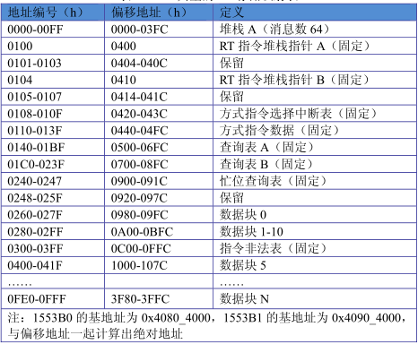
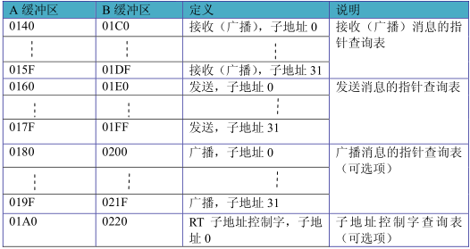

# 1 总线协议

- 帧有若干条消息组成
  - 消息由若干个字组成

## 1.1 RT 工作模式

### 1.1.1存储组织

存储映射表

- 堆栈指针：为堆栈区的起始地址

- 描述符堆栈：消息的描述信息由连续的四个字组成

  - 接收指令字
  - 数据块指针
  - 时间标志字
  - 状态字

- 查询表

  - 接收数据块指针
  - 发送数据块指针
  - 广播数据块指针
  - 字地址控制字

  

