# 1 文件结构

BSP中的SylixOS文件夹：

- bsp文件夹：主要包括系统启动的程序框架代码，有汇编、内存映射、BSP参数配置，编译后会生成符号表文件

- driver文件夹：运行操作系统时需要用到的底层硬件驱动。

- user文件夹：main.c 在系统启动后创建一个shell终端。


# 2 功能

​		为操作系统和上层应用提供一个与硬件无关的软件平台

- 上电时的硬件初始化
- 为操作系统访问硬件驱动程序提供支持
- 集成操作系统所需的软件模块（硬件相关和硬件无关）

**最下系统**：

- 满足在单板上启动操作系统
- 能输出调试信息

# 3 输出文件

**注意查看console输出的内容。**

*.elf:

*.bin:脱掉衣服的ELF文件

*.size

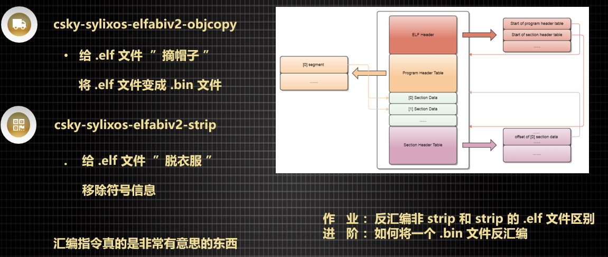

## 3.1 window下的反汇编命令

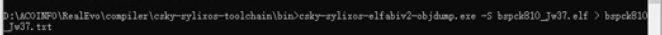

## 3.2 文件介绍

1. config.ld:内存布局

   编译之后生成config.lds

2. SylixOSBSP.ld

3. config.h

4. Makefile

# 4 符号表

**在bsp中上，层应用如何调用到base静态库中（libsylixos）的函数 ？**

答：  通过符号表 ：所谓符号表就是一些函数名或者全局变量。

## 4.1 符号表导出脚本

文件：baseMini2440\libsylixos\SylixOS\hosttools\makesymbol\makesybol.bat

执行该脚本，生成symbol.c和symbol.h文件，在bsp中调用symbol.c和symbol.h中实现的函数生成符号表。4.1.1

## 4.2 symbol.c

**静态符号表**

```c
/****************************************[1]***************************************/
SYMBOL_TABLE_BEGIN					   //[2]				
    SYMBOL_ITEM_FUNC(bb_putchar)       //[3],给结构体LW_STATIC_SYMBOL成员赋值
SYMBOL_TABLE_END
/****************************************[2]***************************************/
//定义了以LW_STATIC_SYMBOL为类型的数组元素。相当于int iArray[] = {1, 2, 3,}
#define SYMBOL_TABLE_BEGIN LW_STATIC_SYMBOL   _G_symLibSylixOS[] = {	
  									   //[4]				
#define SYMBOL_TABLE_END };							
/****************************************[3]***************************************/
#define SYMBOL_ITEM_FUNC(pcName)                       \
    {   {(void *)0, (void *)0},                        \
        #pcName, (char *)pcName,                       \
        LW_SYMBOL_TEXT                                 \
    },	 
/****************************************[4]***************************************/
typedef struct __symbol_dump_list {
    void                *DUMPLIST_pv1;
    void                *DUMPLIST_pv2;
} __SYMBOL_DUMP_LIST;

typedef struct lw_static_symbol {
    __SYMBOL_DUMP_LIST   LWSSYMBOL_dumplist;
    char                *LWSSYMBOL_pcName;
    char                *LWSSYMBOL_pcAddr;
    int                  LWSSYMBOL_iFlag;
} LW_STATIC_SYMBOL; 
```


# 5 Makefile

<<<<<<< HEAD

- 从上往下看，注意注释，*.mk文件，现包含，最后在 mktemp文件中的end.mk下执行all。
- base中与bsp关联的文件大部分在mktemp文件中

# 6 内存管理
=======

# 6 镜像文件的地址空间分布
>>>>>>> 8f1cc947e9cf4032ae9a53fac65b4a66474ea1cc

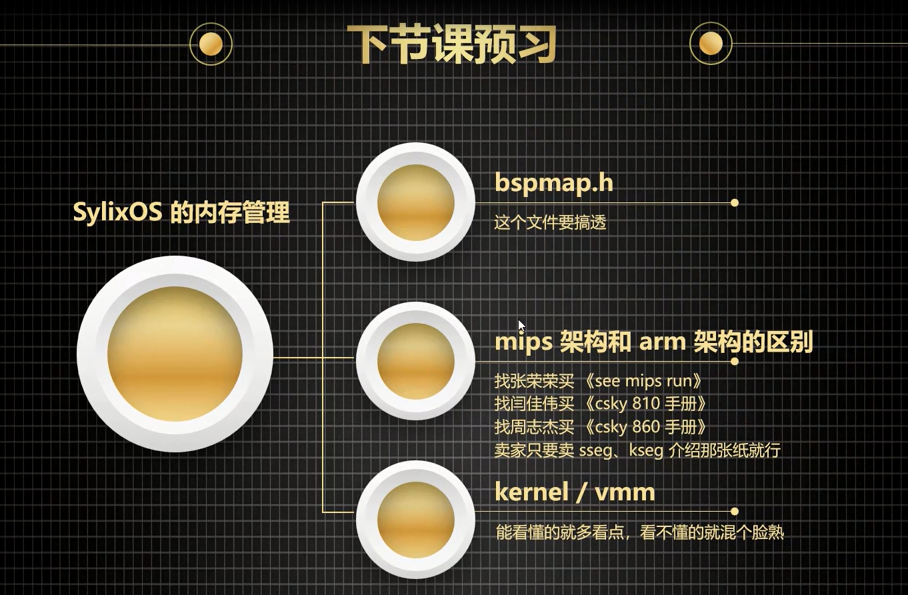

**深入理解计算机原理**


## 6.1 地址空间

### 6.1.1 地址空间统一编址

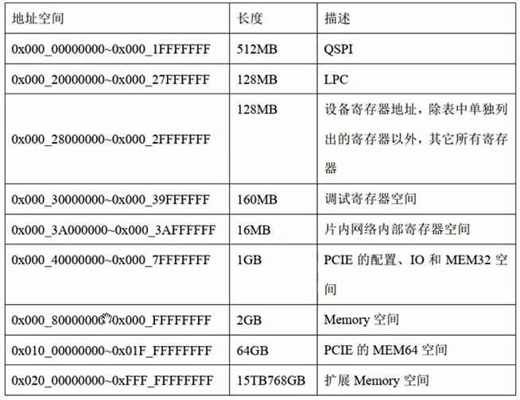

**memory（内存）只是地址空间中的一部分**

### 6.1.2地址空间的划分

文件：bspMap.h

- _G_physicalDesc：

  中断向量表（这个特殊先忽略）
  内核代码段--------------------------------------bsp中的代码段放在内存中的这个位置。
  内核数据段
  DMA 缓冲区
  APP 通用内存
  各种寄存器

- _G_virtualDesc：

  应用程序虚拟空间
  Ioremap空间

```c
LW_MMU_PHYSICAL_DESC    _G_physicalDesc[] = {
    {                                                                   /*  中断向量表                  */
        BSP_CFG_RAM_BASE,
        0,
        LW_CFG_VMM_PAGE_SIZE,
        LW_PHYSICAL_MEM_VECTOR
    },

    {                                                                   /*  内核代码段                  */
        BSP_CFG_RAM_BASE,
        BSP_CFG_RAM_BASE,
        BSP_CFG_TEXT_SIZE,
        LW_PHYSICAL_MEM_TEXT
    },

    {                                                                   /*  内核数据段                  */
        BSP_CFG_RAM_BASE + BSP_CFG_TEXT_SIZE,
        BSP_CFG_RAM_BASE + BSP_CFG_TEXT_SIZE,
        BSP_CFG_DATA_SIZE,
        LW_PHYSICAL_MEM_DATA
    },

    {                                                                   /*  DMA 缓冲区                  */
        BSP_CFG_RAM_BASE + BSP_CFG_TEXT_SIZE + BSP_CFG_DATA_SIZE,
        BSP_CFG_RAM_BASE + BSP_CFG_TEXT_SIZE + BSP_CFG_DATA_SIZE,
        BSP_CFG_DMA_SIZE,
        LW_PHYSICAL_MEM_DMA
    },

    {                                                                   /*  APP 通用内存                */
        BSP_CFG_RAM_BASE + BSP_CFG_TEXT_SIZE + BSP_CFG_DATA_SIZE + BSP_CFG_DMA_SIZE,
        BSP_CFG_RAM_BASE + BSP_CFG_TEXT_SIZE + BSP_CFG_DATA_SIZE + BSP_CFG_DMA_SIZE,
        BSP_CFG_APP_SIZE,
        LW_PHYSICAL_MEM_APP
    },

    /*
     *  external io & memory interface
     */
    {                                                                   /*  BANK4 - CAN CONTROLER       */
        0x20000000,
        0x20000000,
        LW_CFG_VMM_PAGE_SIZE,
        LW_PHYSICAL_MEM_BOOTSFR                                         /*  状态属性 NCNB               */
    },
    {                                                                   /*  BANK5 - AX88796             */
        0x28000000,
        0x28000000,
        (1 * 1024 * 1024),
        LW_PHYSICAL_MEM_BOOTSFR                                         /*  状态属性 NCNB               */
    },
    
    /*
     *  internal sfr area
     */
    {                                                                   /*  memory controller           */
        0x48000000,
        0x48000000,
        LW_CFG_VMM_PAGE_SIZE,
        LW_PHYSICAL_MEM_BOOTSFR
    },
    
    {                                                                   /*  USB HOST controller         */
        0x49000000,
        0x49000000,
        LW_CFG_VMM_PAGE_SIZE,
        LW_PHYSICAL_MEM_BOOTSFR
    },
    
    {                                                                   /*  INTERRUPT controller        */
        0x4a000000,
        0x4a000000,
        LW_CFG_VMM_PAGE_SIZE,
        LW_PHYSICAL_MEM_BOOTSFR
    },
    
    {                                                                   /*  DMA controller              */
        0x4b000000,
        0x4b000000,
        LW_CFG_VMM_PAGE_SIZE,
        LW_PHYSICAL_MEM_BOOTSFR
    },
    
    {                                                                   /*  CLOCK & POWER controller    */
        0x4c000000,
        0x4c000000,
        LW_CFG_VMM_PAGE_SIZE,
        LW_PHYSICAL_MEM_BOOTSFR
    },
    
    {                                                                   /*  LCD controller              */
        0x4d000000,
        0x4d000000,
        LW_CFG_VMM_PAGE_SIZE,
        LW_PHYSICAL_MEM_BOOTSFR
    },
    
    {                                                                   /*  NAND FLASH controller       */
        0x4E000000,
        0x4E000000,
        LW_CFG_VMM_PAGE_SIZE,
        LW_PHYSICAL_MEM_BOOTSFR
    },
    
    {                                                                   /*  CAMERA controller           */
        0x4F000000,
        0x4F000000,
        LW_CFG_VMM_PAGE_SIZE,
        LW_PHYSICAL_MEM_BOOTSFR
    },
    
    {                                                                   /*  UART0 controller            */
        0x50000000,
        0x50000000,
        LW_CFG_VMM_PAGE_SIZE,
        LW_PHYSICAL_MEM_BOOTSFR
    },
    
    {                                                                   /*  UART1 controller            */
        0x50004000,
        0x50004000,
        LW_CFG_VMM_PAGE_SIZE,
        LW_PHYSICAL_MEM_BOOTSFR
    },
    
    {                                                                   /*  UART2 controller            */
        0x50008000,
        0x50008000,
        LW_CFG_VMM_PAGE_SIZE,
        LW_PHYSICAL_MEM_BOOTSFR
    },
    
    {                                                                   /*  PWM TIMER controller        */
        0x51000000,
        0x51000000,
        LW_CFG_VMM_PAGE_SIZE,
        LW_PHYSICAL_MEM_BOOTSFR
    },
    
    {                                                                   /*  USB DEV controller          */
        0x52000000,
        0x52000000,
        LW_CFG_VMM_PAGE_SIZE,
        LW_PHYSICAL_MEM_BOOTSFR
    },
    
    {                                                                   /*  WATCH DOG TIMER controller  */
        0x53000000,
        0x53000000,
        LW_CFG_VMM_PAGE_SIZE,
        LW_PHYSICAL_MEM_BOOTSFR
    },
    
    {                                                                   /*  IIC controller              */
        0x54000000,
        0x54000000,
        LW_CFG_VMM_PAGE_SIZE,
        LW_PHYSICAL_MEM_BOOTSFR
    },
    
    {                                                                   /*  IIS controller              */
        0x55000000,
        0x55000000,
        LW_CFG_VMM_PAGE_SIZE,
        LW_PHYSICAL_MEM_BOOTSFR
    },
    
    {                                                                   /*  I/O PORT  controller        */
        0x56000000,
        0x56000000,
        LW_CFG_VMM_PAGE_SIZE,
        LW_PHYSICAL_MEM_BOOTSFR
    },
    
    {                                                                   /*  RTC  controller             */
        0x57000000,
        0x57000000,
        LW_CFG_VMM_PAGE_SIZE,
        LW_PHYSICAL_MEM_BOOTSFR
    },
    
    {                                                                   /*  A/DC  controller            */
        0x58000000,
        0x58000000,
        LW_CFG_VMM_PAGE_SIZE,
        LW_PHYSICAL_MEM_BOOTSFR
    },
    
    {                                                                   /*  SPI  controller             */
        0x59000000,
        0x59000000,
        LW_CFG_VMM_PAGE_SIZE,
        LW_PHYSICAL_MEM_BOOTSFR
    },

    {                                                                   /*  SD Interface  controller    */
        0x5a000000,
        0x5a000000,
        LW_CFG_VMM_PAGE_SIZE,
        LW_PHYSICAL_MEM_BOOTSFR
    },

    {                                                                   /*  结束                        */
        0,
        0,
        0,
        0
    }
};
/*********************************************************************************************************
  virtual memory
*********************************************************************************************************/
LW_MMU_VIRTUAL_DESC    _G_virtualDesc[] = {
    {                                                                   /*  应用程序虚拟空间            */
        0x60000000,
        ((size_t)2 * LW_CFG_GB_SIZE),
        LW_VIRTUAL_MEM_APP
    },

    {
        0xe0000000,                                                     /*  ioremap 空间                */
        (256 * LW_CFG_MB_SIZE),
        LW_VIRTUAL_MEM_DEV
    },

    {                                                                   /*  结束                        */
        0,
        0,
        0
    }
};
```

## 6.2 bin文件的分布

bin文件比bspMap.h指定的大小**要小**？

答：紧凑排列

- bsp在编译的时候按照链接脚本中规定的按照实际的大小安排位置输出到到bin文件中（	.text段的大小不好确定，在链接脚本中根据实际的地址决定)

  文件：sylixOSBSP.ld

  ```c
  /*********************************************************************************************************
       数据段
  
       .data 段运行地址 VMA 为 ORIGIN(DATA), 装载地址 LMA 为 _etext,
       连接器会将 .data 的初始化数据放在 _etext 的地方, 然后启动程序必须将 _etext 的内容搬运到 
       VMA ORIGIN(DATA) 中. 大小等于 SIZEOF(.data)
  *********************************************************************************************************/
  
      .data ORIGIN(DATA) : AT (_etext) {
          . = ALIGN(8);
          PROVIDE (_data = .);
          
          *(.data)
           
          . = ALIGN(8);
          PROVIDE (_edata = .);
      } > DATA
      
  /*********************************************************************************************************
  ```

- 当bin在内存中启动时按照bspMap.h中规定的大小展开

  文件：startup.S

  ```c
  /*********************************************************************************************************
  ;  初始化 DATA 段，搬移展开
  ;*********************************************************************************************************/
  
      LDR     R1 , =_etext                                                ;/*  -> ROM data end             */
      LDR     R2 , =_data                                                 ;/*  -> data start               */
      LDR     R3 , =_edata                                                ;/*  -> end of data              */
  LINE_LABEL(1)
      CMP     R2 , R3                                                     ;/*  check if data to move       */
      LDRLO   R0 , [R1] , #4                                              ;/*  copy it                     */
      STRLO   R0 , [R2] , #4
      BLO     1b                                                          ;/*  loop until done             */
  
  ```

  BUG：如果bspMap.h中.text段的剩余大小小于.data段的实际大小，那么在搬移的过程.data段覆盖掉尚未搬移的部分。
  
  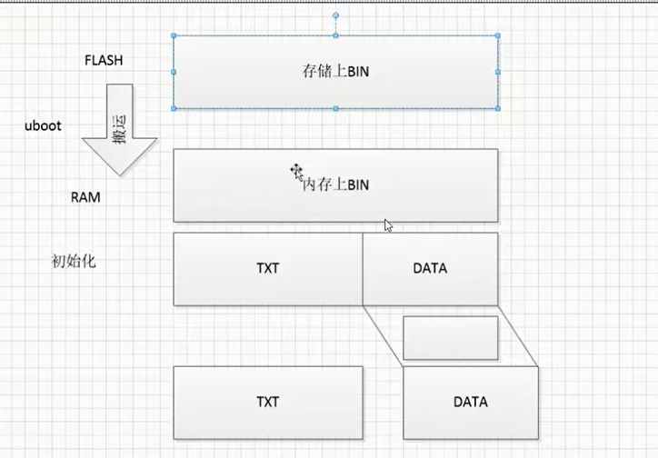

## 6.3加载后的地址分布

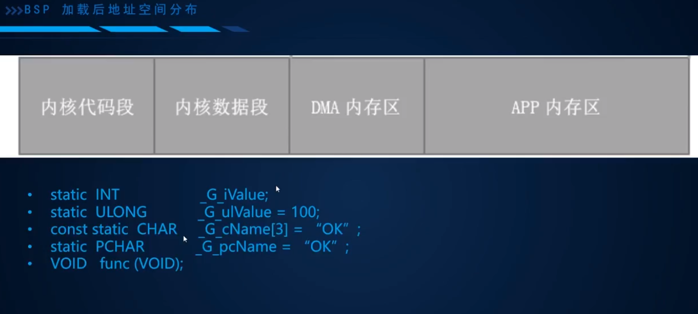

### 6.3.1静态映射

静态映射过的只有 TEXT、DATA、BOOTSFR

### 6.3.2动态映射


分配一个虚拟的地址，当对这个地址读写的时候会进行缺页异常处理分配真实的物理地址

# 7 内核初始化


## 7.1 从boot到系统入口

boot将镜像文件从盘符中搬移到TEXT段定义的地址

文件：config

```c
#include "config.h"

/*********************************************************************************************************
    内存布局定义
*********************************************************************************************************/

MEMORY
{
  TEXT (rx) : ORIGIN = BSP_CFG_RAM_BASE, LENGTH = BSP_CFG_TEXT_SIZE
  DATA (rw) : ORIGIN = BSP_CFG_RAM_BASE + (BSP_CFG_TEXT_SIZE), LENGTH = BSP_CFG_DATA_SIZE
}

BOOT_STACK_SIZE = BSP_CFG_BOOT_STACK_SIZE;
```

## 7.2 从汇编到C入口

### 汇编部分

- 连接脚本初步安排了代码执行的顺序。
- 汇编向C传递参数，通过R0，R1，R2寄存器
- 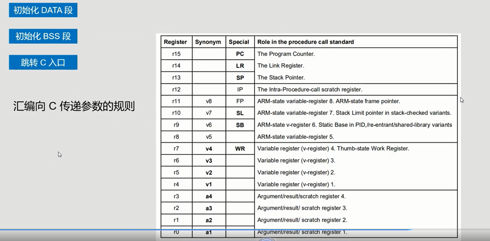

### C部分

```c
    API_KernelStartParam("ncpus=1 kdlog=no kderror=yes kfpu=no heapchk=yes "
                         "rfsmap=/boot:/yaffs2/n0,/:/yaffs2/n1");
                                                                        /*  操作系统启动参数设置        */
    API_KernelStart(usrStartup,
                    (PVOID)&__heap_start,
                    (size_t)&__heap_end - (size_t)&__heap_start,
                    LW_NULL, 0);                                        /*  启动内核                    */

```


## 7.3 内核实现的初始化操作

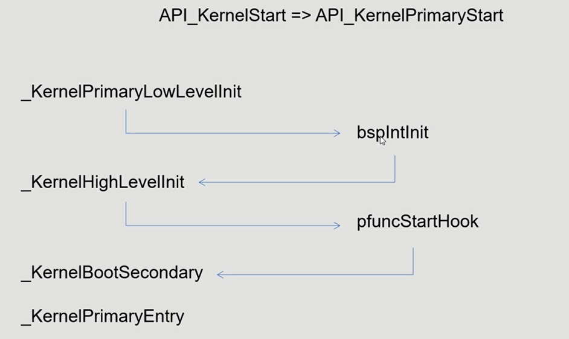

## 7.4 BSP实现的初始化操作

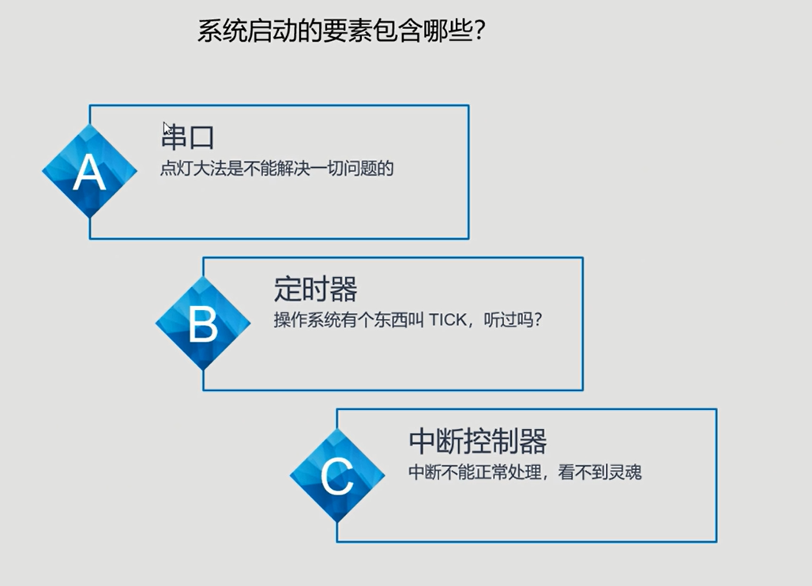

### 7.4.1分类

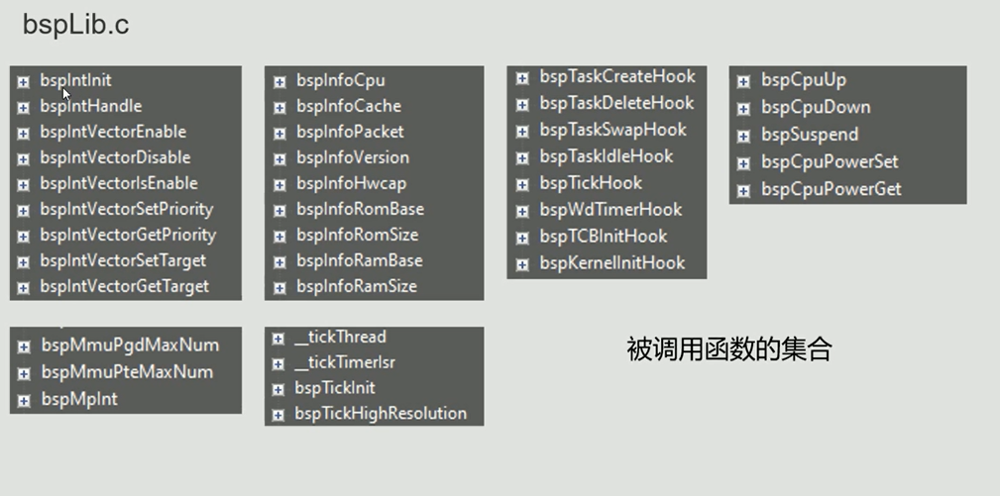

### 7.4.2  bspTicInit驱动

Tic是系统调度依据的节拍。

装载一个计数，每当计数值递减到0的时候会产生一个中断，每次产生中断的间隔就是系统节拍的间隔。

**寄存器的配置**s

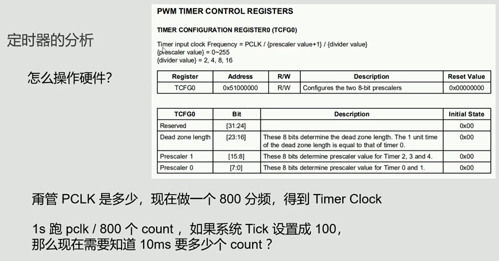

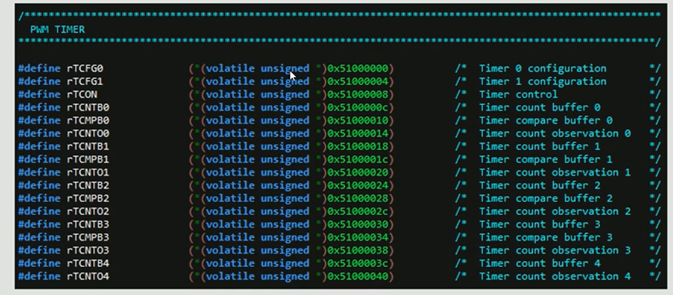

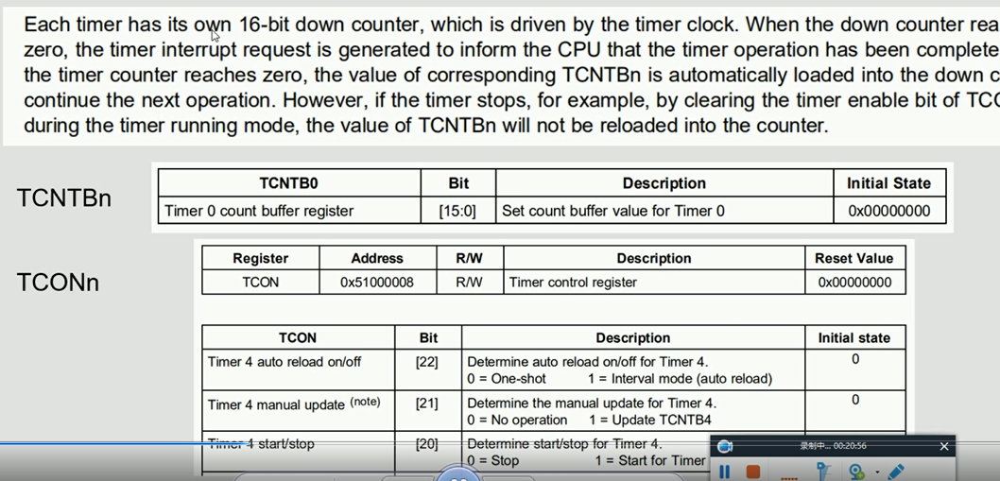


**高精度定时器**

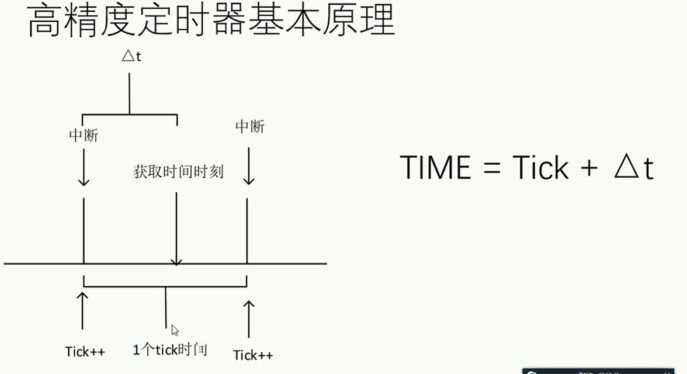

### 7.4.3 时钟原 PCLK

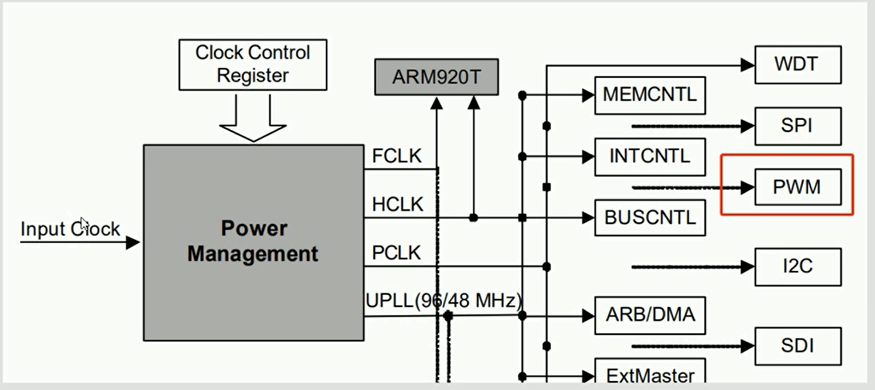

FCLK---->HCLK---->PCLK


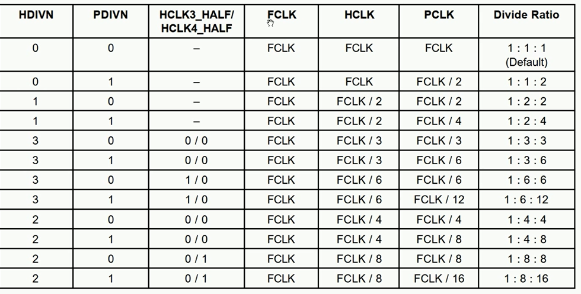

### 7.4.3 系统启动参数分析

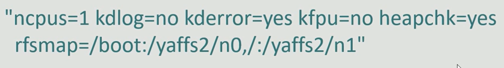


# 8 中断

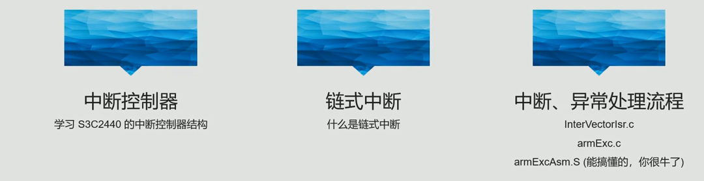

