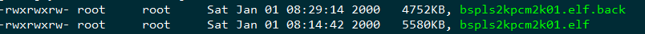
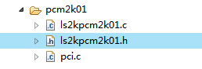

# 1 BSP

## 1.1 pcm2k01配置文件



### 1.1.1RTC 配置文件

**ls2kpcm2k01.c**


```c
VOID  bspBoardTimeInit (VOID)
{
    PLW_RTC_FUNCS       prtcfuncHandle;                  /*  RTC 驱动方法                */

    rtcDrv();                                            /*  安装 RTC 设备驱动程序       */
    prtcfuncHandle = ls2xRtcGetFuncs();                  /*  获得 RTC 驱动方法           */
    rtcDevCreate(prtcfuncHandle);                        /*  创建 RTC 设备               */
    rtcToSys();                                          /*  将 RTC 时间同步到系统时间   */
}
```

