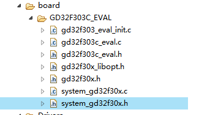

# 1 GD32_MS-RTOS bsp开发

# 1.1 文件介绍



1. gd32f303_eval_init.c

   ms-rtos 初始化文件

2. gd32f303c_eval.c

   外设相关文件：外设的初始化及操作

3. gd32f30x_libopt.h

   外设库选择控制头文件

4. gd32f30x.h

   f30x通用定义：晶振频率、中断向量、位操作、内存分配、外设地址空间分配、等。

5. system_gd32f30x.c

   系统初始化、时钟设置等

   ```c
   void SystemInit (void);
   
   static void system_clock_config(void);
   
   uint32_t SystemCoreClock = __SYSTEM_CLOCK_120M_PLL_HXTAL;
   ```

6. startup_gd32f30x.S

   启动文件