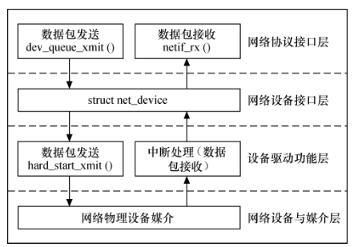
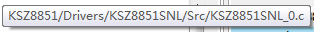

# 以太网驱动


1. BSP 需要调用 `ms_lwip_net_init` 函数初始化 lwIP 协议栈：
2. netif_add：协议栈结构，网协议栈添加驱动信息

## 1 网络设备驱动分层



1. 网络协议接口层

   上层协议独立于具体的设备

2. 网络设备接口层

   规划了下层驱动的结构

3. 设备驱动功能层

   具体的驱动程序

4. 网络设备与媒介层

   硬件设备

## 2 驱动

驱动入口：

## 3 结构

### 3.1 EthHandle

```c
typedef struct {
  ETH_TypeDef                *Instance;     /*!< Register base address       */
  
  ETH_InitTypeDef            Init;          /*!< Ethernet Init Configuration */
  
  uint32_t                   LinkStatus;    /*!< Ethernet link status        */
  
  ETH_DMADescTypeDef         *RxDesc;       /*!< Rx descriptor to Get        */
  
  ETH_DMADescTypeDef         *TxDesc;       /*!< Tx descriptor to Set        */
  
  ETH_DMARxFrameInfos        RxFrameInfos;  /*!< last Rx frame infos         */
  
  __IO HAL_ETH_StateTypeDef  State;         /*!< ETH communication state     */
  
  HAL_LockTypeDef            Lock;          /*!< ETH Lock                    */

  #if (USE_HAL_ETH_REGISTER_CALLBACKS == 1)

  void    (* TxCpltCallback)     ( struct __ETH_HandleTypeDef * heth);  /*!< ETH Tx Complete Callback   */
  void    (* RxCpltCallback)     ( struct __ETH_HandleTypeDef * heth);  /*!< ETH Rx  Complete Callback   */
  void    (* DMAErrorCallback)   ( struct __ETH_HandleTypeDef * heth);  /*!< DMA Error Callback      */
  void    (* MspInitCallback)    ( struct __ETH_HandleTypeDef * heth);  /*!< ETH Msp Init callback       */
  void    (* MspDeInitCallback)  ( struct __ETH_HandleTypeDef * heth);  /*!< ETH Msp DeInit callback     */

} ETH_HandleTypeDef;
```

1. RxDesc

   ```c
   typedef struct  
   {
     __IO uint32_t   Status;           /*!< Status */
     
     uint32_t   ControlBufferSize;     /*!< Control and Buffer1, Buffer2 lengths */
     
     uint32_t   Buffer1Addr;           /*!< Buffer1 address pointer */
     
     uint32_t   Buffer2NextDescAddr;   /*!< Buffer2 or next descriptor address pointer */
     
     /*!< Enhanced Ethernet DMA PTP Descriptors */
     uint32_t   ExtendedStatus;        /*!< Extended status for PTP receive descriptor */
     
     uint32_t   Reserved1;             /*!< Reserved */
     
     uint32_t   TimeStampLow;          /*!< Time Stamp Low value for transmit and receive */
     
     uint32_t   TimeStampHigh;         /*!< Time Stamp High value for transmit and receive */
   
   } ETH_DMADescTypeDef;
   ```

### 3.2 协议栈结构

1. 数据包结构

   ```c
   /** Main packet buffer struct */
   struct pbuf {
     /** next pbuf in singly linked pbuf chain */
     struct pbuf *next;
   
     /** pointer to the actual data in the buffer */
     void *payload;
   
     /**
      * total length of this buffer and all next buffers in chain
      * belonging to the same packet.
      *
      * For non-queue packet chains this is the invariant:
      * p->tot_len == p->len + (p->next? p->next->tot_len: 0)
      */
     u16_t tot_len;
   
     /** length of this buffer */
     u16_t len;
   
     /** a bit field indicating pbuf type and allocation sources
         (see PBUF_TYPE_FLAG_*, PBUF_ALLOC_FLAG_* and PBUF_TYPE_ALLOC_SRC_MASK)
       */
     u8_t type_internal;
   
     /** misc flags */
     u8_t flags;
   
     /**
      * the reference count always equals the number of pointers
      * that refer to this pbuf. This can be pointers from an application,
      * the stack itself, or pbuf->next pointers from a chain.
      */
     LWIP_PBUF_REF_T ref;
   
     /** For incoming packets, this contains the input netif's index */
     u8_t if_idx;
   };
   ```

### 3.3 KSZ8851结构

```c
struct KSZ8851_INTERFACE
{
  uint32_t cs_port;
  uint16_t cs_pin;
  uint32_t rst_port;
  uint16_t rst_pin;
  SPI_HandleTypeDef *hspi;
  uint8_t MAC_address[6];

  uint16_t rxqcr;
  uint16_t frameId;
  uint8_t rxFrameCount;
  uint8_t dma_rx_ended;
  uint8_t dma_tx_ended;
  uint16_t isr_old;
  uint8_t isr_ocurred;
  uint16_t isr_reg;
  uint8_t link;
  uint8_t speed;
  uint8_t duplex;
  uint8_t state;
};
```

### 3.4 SPI_INIT结构

```c
typedef struct
{
  uint32_t Mode;                /*!< Specifies the SPI operating mode.
                                     This parameter can be a value of @ref SPI_Mode */

  uint32_t Direction;           /*!< Specifies the SPI bidirectional mode state.
                                     This parameter can be a value of @ref SPI_Direction */

  uint32_t DataSize;            /*!< Specifies the SPI data size.
                                     This parameter can be a value of @ref SPI_Data_Size */

  uint32_t CLKPolarity;         /*!< Specifies the serial clock steady state.
                                     This parameter can be a value of @ref SPI_Clock_Polarity */

  uint32_t CLKPhase;            /*!< Specifies the clock active edge for the bit capture.
                                     This parameter can be a value of @ref SPI_Clock_Phase */

  uint32_t NSS;                 /*!< Specifies whether the NSS signal is managed by
                                     hardware (NSS pin) or by software using the SSI bit.
                                     This parameter can be a value of @ref SPI_Slave_Select_management */

  uint32_t BaudRatePrescaler;   /*!< Specifies the Baud Rate prescaler value which will be
                                     used to configure the transmit and receive SCK clock.
                                     This parameter can be a value of @ref SPI_BaudRate_Prescaler
                                     @note The communication clock is derived from the master
                                     clock. The slave clock does not need to be set. */

  uint32_t FirstBit;            /*!< Specifies whether data transfers start from MSB or LSB bit.
                                     This parameter can be a value of @ref SPI_MSB_LSB_transmission */

  uint32_t TIMode;              /*!< Specifies if the TI mode is enabled or not.
                                     This parameter can be a value of @ref SPI_TI_mode */

  uint32_t CRCCalculation;      /*!< Specifies if the CRC calculation is enabled or not.
                                     This parameter can be a value of @ref SPI_CRC_Calculation */

  uint32_t CRCPolynomial;       /*!< Specifies the polynomial used for the CRC calculation.
                                     This parameter must be an odd number between Min_Data = 1 and Max_Data = 65535 */

  uint32_t CRCLength;           /*!< Specifies the CRC Length used for the CRC calculation.
                                     CRC Length is only used with Data8 and Data16, not other data size
                                     This parameter can be a value of @ref SPI_CRC_length */

  uint32_t NSSPMode;            /*!< Specifies whether the NSSP signal is enabled or not .
                                     This parameter can be a value of @ref SPI_NSSP_Mode
                                     This mode is activated by the NSSP bit in the SPIx_CR2 register and
                                     it takes effect only if the SPI interface is configured as Motorola SPI
                                     master (FRF=0) with capture on the first edge (SPIx_CR1 CPHA = 0,
                                     CPOL setting is ignored).. */
} SPI_InitTypeDef;

```

```c
typedef struct __DMA_HandleTypeDef
{
  DMA_Stream_TypeDef         *Instance;                                                    /*!< Register base address                  */

  DMA_InitTypeDef            Init;                                                         /*!< DMA communication parameters           */ 

  HAL_LockTypeDef            Lock;                                                         /*!< DMA locking object                     */  

  __IO HAL_DMA_StateTypeDef  State;                                                        /*!< DMA transfer state                     */

  void                       *Parent;                                                      /*!< Parent object state                    */ 

  void                       (* XferCpltCallback)( struct __DMA_HandleTypeDef * hdma);     /*!< DMA transfer complete callback         */

  void                       (* XferHalfCpltCallback)( struct __DMA_HandleTypeDef * hdma); /*!< DMA Half transfer complete callback    */

  void                       (* XferM1CpltCallback)( struct __DMA_HandleTypeDef * hdma);   /*!< DMA transfer complete Memory1 callback */
  
  void                       (* XferM1HalfCpltCallback)( struct __DMA_HandleTypeDef * hdma);   /*!< DMA transfer Half complete Memory1 callback */
  
  void                       (* XferErrorCallback)( struct __DMA_HandleTypeDef * hdma);    /*!< DMA transfer error callback            */
  
  void                       (* XferAbortCallback)( struct __DMA_HandleTypeDef * hdma);    /*!< DMA transfer Abort callback            */  

 __IO uint32_t               ErrorCode;                                                    /*!< DMA Error code                          */
  
 uint32_t                    StreamBaseAddress;                                            /*!< DMA Stream Base Address                */

 uint32_t                    StreamIndex;                                                  /*!< DMA Stream Index                       */
 
}DMA_HandleTypeDef;
```


## 4 KSZ8851网卡驱动

### 4.1 初始化

1. 调用入口

   1. ethernetif_init：在BSP里面调用

   2. 调用函数：netif_add(&gnetif, &ipaddr, &netmask, &gw, NULL, &ethernetif_init, &tcpip_input);

      netif_add：协议栈接口
   
2. 功能：填充 **struct netif *netif**

3. 调用接口：

   1. low_level_output_KSZ8851_0，赋值给协议栈的回调函数
   2. low_level_init_KSZ8851_0，初始化KSZ8851 
      1. 调用接口 ksz8851_init_0，位置：KSZ88511SNL_0.c
         1. 调用接口：
            1. ksz8851_init,
               1. 位置：KSZ8851SNL.c,
               2. 功能：配置SPI，

### 4.2 接收数据

1. 调用入口：bsp轮询调用
2. 

### 4.3 发送数据

low_level_output_KSZ8851_0；

1. 调用入口：
   1. 位置：ethernetif_init_KSZ8851_0
   2. 由上层协议栈回调
2. 调用接口：
   1. 

### 4.4 SPI配置文件

spi.c

## 5 移植

BSP_QSPI_MspInit = MX_GPIO_Init (gpio.c)

# 以太网卡控制器

