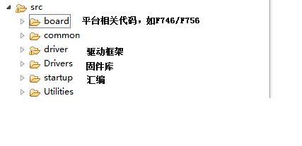

# 1 工程结构



1. 在Makefile中决定编译哪一个平台的BSP

   ```makefile
   #*********************************************************************************************************
   # Include targets makefiles
   #*********************************************************************************************************
   include stm32f7hal.mk
   include src/board/STM32F746G-Discovery/bspstm32f746g_disco.mk
   ```

2. 


# 2 变更方案

## 2.1 board目录下

**新建一个开发板平台目录文件**：STM32F767

1. 初始化文件:把旧版本bspstm32f767/src/bsp_init.c移植到STM32F767/stm32f767_init.c
2. 配置头文件：把旧版本bspstm32f767/config.h 移植到STM32F767/stm32f767_cfg.c
3. Makeflie:把旧版本bspstm32f767/bspstm32f767_mk移植到STM32F767/bspstm32f767_mk
4. 中断服务函数：？
5.  stm32f7xx_hal_conf.h

## 2.2 startup

stm32f767汇编文件

## 2.3 板级配置头文件

定义目标板的配置文件

## 2.4 原生网卡驱动移植

把板级相关代码**HAL_ETH_MspInit**放到board/stm32f767_netif.c中

## 2.5 kszn8851网卡

# 3 接口

## 3.1 添加命令接口

MS_SHELL_CMD(cmd,   shell_process, "for what", __ms_shell_cmd);

```c
#include "ms_shell_cfg.h"
#include "ms_shell.h"

static void __ms_shell_ksz8851(int argc, char *argv[], const ms_shell_io_t *io)
{
   /*
    * do something
    */
    
    io->_printf("ier = %x, isr=%x\n", ier, isr);
}

MS_SHELL_CMD(ksz8851,   __ms_shell_ksz8851, "Show ksz8851 ier and isr", __ms_shell_cmd_ksz8851);
```

