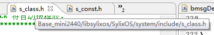

# 1 BSP

1. 运行硬件平台所必须的驱动和初始化程序。

- 同一个芯片的多种驱动支持组合
- 把驱动和内核静态编译，生成系统镜像
- 实现系统的初始化，保证系统能够运行的最小系统环境

2. 硬件相关层，处于硬件平台和操作系统之间，用来屏蔽硬件差异。

# 2 驱动设备的并发与同步

## 2.1 并发与竞争

SMP是真正意义上的并行

- SMP访问共同资源
- 内核进程的抢占
- 中断

## 2.2 同步机制

避免并发，防止竞争

- 中断屏蔽
- 原子操作
- 信号量
- 自旋锁
  - 带中断屏蔽功能的自旋锁

# 3内核模块

**声明**

```
#define		__SYLIXOS_KERNEL
```

**头文件**

```
#include <SyliOS.h>
#include <module.h>
```

# 4 GPIO 驱动模型

## 4.1 位置

```
bps/SylixOS/driver/gpio/gpio.c
```

## 4.2 GPIO控制器功能结构体

```c
typedef struct lw_gpio_chip {
    CPCHAR		 GC_pcLabel;
    LW_LIST_LINE  GC_lineManage;
    INT  (*GC_pfuncRequeset) (struct lw_gpio_chip  *pgchip, UINT  uiOffset);
    //……,管脚输入/输出等，所有可能的操作。
} LW_GPIO_CHIP;
```

## 4.3 GPIO控制器寄存器


## 4.4 GPIO内核态API


# 5 中断系统

## 5.1 中断信号线

处理器只有两根中断线：

- IRQ
- FIQ

外设不直接与CPU的中断线相连

**实现过程：**

1. 外部设备发生状态改变时主动发送一个信号给中断控制器
2. 中断控制器判断信号的中断优先级
3. 中断控制器根据优先级把中断信号通过IRQ/FIQ这两根线发给CPU


## 5.2 中断处理过程

- 系统会对中断信号进行编号（0~255）中断编号就是中断向量

- CPU每执行一条指令都会去检查是否有中断请求发生


## 5.3 中断系统分析

### 5.3.1 中断向量表

​		中断向量表的大小为256，用于管理每一个中断向量：_k_idescTable[256]。


- 中断服务函数列表：通常情况下一个中断向量对应一个中断服务函数，则链表内只有一个成员。特殊情况下可以有多个。

### 5.3.2 中断描述符

​		每个中断服务函数会对应一个中断描述符。


- 管理链表：用于将中断描述符加入到中断向量表项目中。

## 5.4 中断的使用

1. 申请，把中断号与终端服务函数连接。

   

2. 使能中断

   

3. 清除中断

   

4. 释放

   1. 释放一个对应的函数。

      

   2. 释放所有

      

      

   


# 6 字符设备驱动框架

## 6.1 字符设备驱动的安装

安装字符设备驱动，返回驱动程序索引号**iDrvNum**

- API_LosDrvInstall
- API_LosDrvInstallEx(设备文件操作块)
- API_LosDrvInstallEx2(设备文件操作块+设备驱动类型)

**在系统里面添加设备文件操作块**

### 6.1.2设备文件操作块


#### 1 open

​		在应用使用open函数时，系统会调用该函数

1. 添加一个 fd_node(文件节点)NWE_ONE型

   ```c
   /************************************************************************************
   ** 函数名称: API_IosFdNodeAdd
   ** 功能描述: 添加一个 fd_node (如果同一个设备已经有一个重复的 inode 被打开则只增加引用)
   ** 输　入  : pplineHeader  同一设备 fd_node 链表
   **           dev           设备描述符
   **           inode64       文件 inode (同一设备 inode 必须唯一)
   **           iFlags        打开选项
   **           mode          文件 mode
   **           uid           所属用户 id
   **           gid           所属组 id
   **           oftSize       文件当前大小
   **           pvFile        驱动私有信息
   **           pbIsNew       返回给驱动程序告知是否为新建节点还是
   ** 输　出  : fd_node
   ** 全局变量: 
   ** 调用模块: 
   ** 注  意  : 此函数线程不安全, 需要在设备锁内执行
                                              API 函数
   ************************************************************************************/
   LW_API 
   PLW_FD_NODE  API_IosFdNodeAdd (LW_LIST_LINE_HEADER  *pplineHeader,
                                  dev_t                 dev,
                                  ino64_t               inode64,
                                  INT                   iFlags,
                                  mode_t                mode,
                                  uid_t                 uid,
                                  gid_t                 gid,
                                  off_t                 oftSize,
                                  PVOID                 pvFile,
                                  BOOL                 *pbIsNew)
   ```

2. 删除文件节点

   ```c
   /**************************************************************************
   ** 函数名称: API_IosFdNodeDec
   ** 功能描述: 删除一个 fd_node (如果引用不为 1 则只是 -- )
   ** 输　入  : pplineHeader  同一设备 fd_node 链表
   **           pfdnode       fd_node
   **           bRemove       是否需要删除文件.
   ** 输　出  : -1 : 错误
   **            0 : 正常删除
   **           >0 : 减少引用后的引用数量
   ** 全局变量: 
   ** 调用模块: 
   ** 注  意  : 此函数线程不安全, 需要在设备锁内执行
                                              API 函数
   **************************************************************************/
   LW_API 
   INT  API_IosFdNodeDec (LW_LIST_LINE_HEADER  *pplineHeader,
                          PLW_FD_NODE           pfdnode,
                          BOOL                 *bRemove)
   ```


### 6.2.2 设备结构

​		为什么要把设备头放在结构体的第一个成员的位置？

答：**设备头记录了设备结构的首地址，把LW_DEV_HDR类型的设备头强转为设备结构后便于访问其他成员**

```c
typedef struct {
    LW_DEV_HDR          BMSGD_devhdrHdr;                                /*  设备头             ……
    ……
    ……
   
} LW_XXX_DEV;
```


## 6.2 字符设备的创建及管理

- 设备头


- API_IosDevAdd/API_IosDevAddEX

  添加设备头，根据设备程序索引号创建字符设备

## 6.3 为什么要使用copy_from_user

1. 对用户空间传来的地址范围进行合法性检查
2. 用户传来的地址还没有分配物理地址时，会处理缺页异常以保证程序顺利执行。

## 6.4 应用层如何调用到底层

### 6.4.1 open

​		应用层open---------------------------------------->API_IosOpen

```c
LONG  API_IosOpen (PLW_DEV_HDR    pdevhdrHdr,
                   PCHAR          pcName,
                   INT            iFlag,
                   INT            iMode)
{
    REGISTER LONGFUNCPTR  pfuncDrvOpen = _S_deventryTbl[__LW_DEV_MAINDRV].DEVENTRY_pfuncDevOpen;
    
    if (pfuncDrvOpen) {
        LONG    lFValue;
        __KERNEL_SPACE_ENTER();
        lFValue = pfuncDrvOpen(pdevhdrHdr, pcName, iFlag, iMode);
        __KERNEL_SPACE_EXIT();
        return  (lFValue);//返回lFValue，赋值给文件结构的FDENTRY_lValue
        
    } else {
        _ErrorHandle(ERROR_IOS_DRIVER_NOT_SUP);
        return  (PX_ERROR);
    }
}
```

### 6.4.2 write

​		应用层write---------------------------------------->API_IosWrite

```c
ssize_t  API_IosWrite (INT      iFd,
                       CPCHAR   pcBuffer,
                       size_t   stNBytes)
{
    REGISTER SSIZETFUNCPTR pfuncDrvWrite;
    REGISTER PLW_FD_ENTRY  pfdentry;
    
    pfdentry = _IosFileGet(iFd, LW_FALSE);
    
    if ((pfdentry == LW_NULL) || (pfdentry->FDENTRY_ulCounter == 0)) {
        _DebugHandle(__ERRORMESSAGE_LEVEL, "file descriptor invalidate.\r\n");
        _ErrorHandle(ERROR_IOS_INVALID_FILE_DESCRIPTOR);
        return  (PX_ERROR);
    }
    
    if ((pfdentry->FDENTRY_iFlag & (O_WRONLY | O_RDWR)) == 0) {
        _DebugHandle(__ERRORMESSAGE_LEVEL, "file can not write.\r\n");
        _ErrorHandle(ERROR_IOS_FILE_WRITE_PROTECTED);
        return  (PX_ERROR);
    }
***********************************得到驱动程序的函数指针*******************************  
    pfuncDrvWrite = _S_deventryTbl[__LW_FD_MAINDRV].DEVENTRY_pfuncDevWrite;
*************************************************************************************    
    if (pfuncDrvWrite) {
        ssize_t     sstNum;
        PVOID       pvArg = __GET_DRV_ARG(pfdentry);   /*  根据驱动程序版本类型选择参数*/
        __KERNEL_SPACE_ENTER();				//new_one型，传入它自己，否则为FDENTRY_lValue
        sstNum = pfuncDrvWrite(pvArg, pcBuffer, stNBytes);	//首地址是设备头
        __KERNEL_SPACE_EXIT();
        
        MONITOR_EVT_LONG3(MONITOR_EVENT_ID_IO, MONITOR_EVENT_IO_WRITE, 
                          iFd, stNBytes, sstNum, LW_NULL);
                         
        return  (sstNum);
        
    } else {
        _DebugHandle(__ERRORMESSAGE_LEVEL, "driver not support.\r\n");
        _ErrorHandle(ERROR_IOS_DRIVER_NOT_SUP);
        return  (PX_ERROR);
    }
}
```

## 6.5 文件系统

位置：



​		文件结构：如果为 ORIG 类型驱动，则传入write的参数为open返回的值（FDENTRY_lValue），若为NEW_1 类型驱动，则传入write的参数为**LW_FD_ENTRY**结构的首地址。write的首参数类型必须为文件节点类型（PLW_FD_ENTRY），open的返回值类型为：PLW_FD_NODE。

```c
/*********************************************************************************************************
  文件结构 (文件表)
  FDENTRY_ulCounter 计数器是所有对应的 LW_FD_DESC 计数器总和. 
  如果没有 dup 过, 则 FDENTRY_ulCounter 应该与 FDDESC_ulRef 相同.
  
  如果是 ORIG 类型驱动:
  则 open 后传入驱动的首参数为 FDENTRY_lValue.
  
  如果是 NEW_1 类型驱动:
  则 open 后传入驱动的首参数为 fd_entry 本身, FDENTRY_lValue 为 open 返回值其首参数必须为 LW_FD_NODE.
  需要说明的是 FDENTRY_oftPtr 字段需要驱动程序自己来维护.
*********************************************************************************************************/
typedef struct {
    PLW_DEV_HDR                FDENTRY_pdevhdrHdr;    /*  设备头                      */
    PCHAR                      FDENTRY_pcName;        /*  文件名                      */
    PCHAR                      FDENTRY_pcRealName;    /*  去除符号链接的真实文件名    */
    LW_LIST_LINE               FDENTRY_lineManage;    /*  文件控制信息遍历表          */
    
#define FDENTRY_pfdnode        FDENTRY_lValue
    LONG                       FDENTRY_lValue;        /*  驱动程序内部数据            */
                                                      /*  如果为 NEW_1 驱动则为fd_node*/
    INT                        FDENTRY_iType;         /*  文件类型 (根据驱动判断)     */
    INT                        FDENTRY_iFlag;         /*  文件属性                    */
    LW_FD_STATE                FDENTRY_state;         /*  文件状态                    */
    ULONG                      FDENTRY_ulCounter;     /*  总引用计数器                */
    off_t                      FDENTRY_oftPtr;        /*  文件当前指针                */
                                                      /*  只有 NEW_1 或更高级驱动使用 */
    BOOL                       FDENTRY_bRemoveReq;    /*  删除请求                    */
} LW_FD_ENTRY;
typedef LW_FD_ENTRY           *PLW_FD_ENTRY;
```

# 7 PROC文件系统

​		使用 /proc 文件系统来访问 SylixOS 内核的内容，这个虚拟文件系统，在内核空间和用户空间之间打开了一个通信窗口。

# 8 文件系统

# 9 I2C总线框架

## 9.1 设备驱动端

1. I2C总线适配器操作函数

   

2.  传输函数指针

   ```c
   PLW_I2C_FUNC	pi2cfunc
   ```

3. 传输函数

   

4. 总线适配器

   PLW_I2C_ADAPTER	pi2cadapter


5. I2C设备结构体

   

6. API_I2cDeviceCreate()

   创建I2c从机设备，填充PLW_I2C_DEVICE结构体

# 10 DMA

## 1.1 通用原理

1. CPU通过**控制指令**使能DMA控制器
2. CPU通过**配置指令**配置DMA的源地址、目的地址、搬运方向、搬运长度。（DMA操作物理地址）
3. DMA通过中断通知CPU搬运成功与否，CPU不参与数据传输。


## 1.2 驱动模型

主要包括两个部分：

- 驱动的注册：Base/libsylixos/SylixOS/system/device/dma

- 驱动程序的具体实现

> **内核相关代码**
>
> >位置：Base/libsylixos/SylixOS/system/device/dma
> >
> >主要函数：Base_IMX6Q/libsylios/SylixOS/driver/dma/i8237a.c
> >
> >```c
> >/**********************************************************************************
> >** 函数名称: API_DmaDrvInstall
> >** 功能描述: 安装通用 DMA 驱动程序
> >** 输　入  : uiChannel              通道
> >**           pdmafuncs              驱动函数集
> >**           stMaxDataBytes         每一次传输的最多字节数
> >** 输　出  : ERROR
> >** 全局变量: 
> >** 调用模块: 
> >                                           API 函数
> >**********************************************************************************/
> >LW_API 
> >INT    API_DmaDrvInstall (UINT              uiChannel,
> >                          PLW_DMA_FUNCS     pdmafuncs,
> >                          size_t            stMaxDataBytes)
> >```
> >
> >功能：创建DAM设备驱动将其**注册**到内核中
>
> **驱动程序的实现**
>
> >位置：Base_IMX6Q/libsylios/SylixOS/driver/dma/i8237a.c
> >
> >主要函数：
> >
> >```c
> >/**********************************************************************************
> >** 函数名称: i8237aGetFuncs
> >** 功能描述: 初始化 i8237a 驱动程序
> >** 输　入  : pctl       8237a 控制块
> >** 输　出  : DMA 驱动集合
> >** 全局变量: 
> >** 调用模块: 
> >**********************************************************************************/
> >PLW_DMA_FUNCS  i8237aGetFuncs (I8237A_CTL *pctl)
> >{
> >    static I8237A_DMA_FUNCS    i8237a;
> >           PLW_DMA_FUNCS       pdmafuncs = &i8237a.dmafuncs;
> >    
> >    i8237a.ctl = *pctl;
> >    
> >    if (pdmafuncs->DMAF_pfuncReset == LW_NULL) {
> >        pdmafuncs->DMAF_pfuncReset  = i8237aReset;
> >        pdmafuncs->DMAF_pfuncTrans  = i8237aTrans;
> >        pdmafuncs->DMAF_pfuncStatus = i8237aStatus;
> >    }
> >    
> >    return  (&i8237a.dmafuncs);
> >}
> >```
> >
> >功能：填充**PLW_DMA_FUNCS**结构体，实现**PLW_DMA_FUNCS**中定义的函数指针

## 1.2 驱动框架


# 11 串口设备驱动

**tty子系统**

## 11.1串口驱动的实现

1. 初始化串口通道私有数据
2. 初始化硬件寄存器
3. 在内核中注册驱动

### 11.1.1创建

 		**创建通道并完成初始化，返回串口通道结构体指针**，在系统启动的过程中调用该函数，并将串口通道结构体返回到调用它的地方。


​		驱动程序的工作是实现pDrvFuncs中定义的方法，完成对**SOI_DRV_FUNCS**中函数指针的填充，然后通过上面的串口通道创建函数返回


### 11.1.2填充

​		采用宏的方式填充**SOI_DRV_FUNCS**中的函数指针

**1 通过sioIoctl设置串口：**


1. 波特率设置
2. 线控参数设置

CMD如下：


线控参数如下：


**2 通过sioTxStartup启动串口，发送数据，发送成功后会触发串口中断。**


**3 回调函数？？？？？**


​		轮询模式收发


## 11.2 tty设备驱动的安装

 		在创建tty设备之前需要安装设备驱动


## 11.3 tty设备的创建


# 12 INPUT设备驱动

# 13 块设备

> 页
>
> > 段
> >
> > > 块：由一个扇区或多个扇区组成
> > >
> > > > 扇区：硬件对数据处理的基本单位大小为：512Byte


整体框架


## 13.1 驱动模型

**通过以下函数创建的块设备驱动进供内核使用，用户不可见**，应用层可以通过IO系统进行操作。

块设备存在两种模型：

- LW_BLK_DEV:默认的挂载模式
- LW_BLK_RAW：原始的模式（BLOCK模式）

### 13.1.1 LW_BLK_DEV模式

​		是文件系统操作的对象，对用户不可见


1. **LW_BLK_DEV结构体**

   

2. **创建设备驱动**


### 13.1.2 LW_BLK_RAW 模式

​		用户可以之间操作，也可以通过文件系统操作。


1. **LW_BLK_RAW 结构体**

   

2. **创建设备驱动**

   

## 13.2 块设备的IO控制

​		块设备的IO接口与IO系统无关，仅供文件系统调用，用户不可直接调用。

**IO控制函数**：仅供文件系统调用，用户不可直接调用。


## 13.3 块设备的创建

​		操作系统会在/dev/blk(设备目录)下创建块设备文件，应用层可以对其进行IO操作，源码在：

```shell
libsylixos/SylixOS/fs/oemDisk/oemBlkIo.c
```

## 13.4 块设备CACHE管理

### 13.4.1  创建磁盘cache块设备


### 13.4.2 同步

​		将缓存中的脏页回写到存储介质中。

- **回写方式：**   

  指定扇区范围回写

  指定扇区数量回写

  指定关键区会回写

- 以LRU管理cache缓存

  LRU：页面置换算法，淘汰最近不经常使用的页面。

### 13.4.3 块设备的读写操作

​		当文件系统需要读写操作时，会调用磁盘对应的cache块设备的读写操作

## 13.5 磁盘分区管理

MBR：主引导记录

## 13.6 磁盘高速传输

1. cache回写的过程：

   - 直接回写

   - 多线管并发回写（Base/libsylixos/SylixOS/fs/diskCache/diskCachePipeline.c)

     多线管并发写管线线程：__diskCacheWpThread

     __diskCacheWpCreate 根据传入的参数创建写管线线程（填充相关信息到写管线控制结构体）

2. 管线的使用

   在cache回写时调用“__diskCacheFlushList”，将链表内的CACHE节点扇区全部会写磁盘

## 13.7 磁盘阵列管理

​		RAID:将几个物理磁盘合成一个更大的磁盘组，提高性能。


## 13.8 NandFlash与MTD设备管理

1. NAND 

   NOR：成本高、容量小、不易出错

   NAND：容量大，容易出错

   NAND构成：

   > chip
   >
   > > plane
   > >
   > > > block
   > > >
   > > > > page
   > > > >
   > > > > >OBB(空闲区域)，用于放置数据的校验值（通过EDC/ECC)

   

   擦除以块为单位，读写以页为单位

   每一片（Plane）都有一个对应的PAGE Buffer：用于存放将要读写到物理存储单元中的那一页数据。

2. MTD

   是对NAND Flash的抽象，既不是块设备也不是字符设备，位于底层硬件和上层软件之间。

   驱动开发只需关注：NAND Flash的DATASHEET的底层硬件驱动。

   

   

# 14 SD卡

## 14.1 SD总线

1. SD卡总线模式：
   - SD模式
   - SPI模式
2. SD总线会话
   - 命令
   - 应答
   - 数据

## 14.2 SD系统架构


​		HOST层：硬件控制抽象层，不用平台有不同的实现，对Core层提供统一接口。

​		Core层：提供传输方式和协议库,SDM是驱动管理层，包括设备驱动和控制器驱动

​		Client层：实现SD卡和SDIO类设备。

## 14.3 库系统初始化

​		在注册任何SD设备前必须进行系统库初始化。

```c
/****************************************************************************************
** 函数名称: s5pv210sdiInit
** 功能描述: SD 驱动初始化
** 输    入: NONE
** 输    出: NONE
** 全局变量:
** 调用模块:
****************************************************************************************/
VOID imx6qSdLibInit (VOID)
{
    API_SdmLibInit();
    API_SdmSdioLibInit();                                  /*  SD 库初始化, 必须放在前面   */

    API_SdioBaseDrvInstall();
    API_SdMemDrvInstall();                                /*  安装应用层驱动              */
}
```

## 14.4 应用

实现的位置：libsylixos/SylixOS/system/device/sd

> 创建总线适配器
>
> ```c
> /************************************************************************************
> ** 函数名称: API_SdAdapterCreate
> ** 功能描述: 创建一个sd适配器
> ** 输    入: pcName     适配器名称
> **           psdfunc    适配器总线操作
> ** 输    出: NONE
> ** 返    回: ERROR CODE
> ** 全局变量:
> ** 调用模块:
> ************************************************************************************/
> LW_API
> INT  API_SdAdapterCreate (CPCHAR pcName, PLW_SD_FUNCS psdfunc)
> ```
>
> > 使用PLW_SD_FUNCS**向内核传递**函集合
> >
> > ```c
> > typedef struct lw_sd_funcs {
> >     INT (*SDFUNC_pfuncMasterXfer)(PLW_SD_ADAPTER          psdadapter,
> >                                   struct lw_sd_device    *psddevice,
> >                                   PLW_SD_MESSAGE          psdmsg,
> >                                   INT                     iNum);
> >     INT (*SDFUNC_pfuncMasterCtl)(PLW_SD_ADAPTER          psdadapter,
> >                                  INT                     iCmd,
> >                                  LONG                    lArg);
> > } LW_SD_FUNCS, *PLW_SD_FUNCS;
> > ```
> >
> > 


# 15 RTC

1. 实时时钟，在系统掉电的情况下利用电源使时钟继续运行，保存时间信息。

2. 驱动实现

> 底层驱动实现（配置寄存器）
>
> > 文件：bsp/SylixOS/driver/rtc/rtc.c

---

> 设备驱动实现（安装驱动，创建设备文件）
>
> >文件：Base/libsylixos/SylixOS/system/device/hwrtc/hwrtc.c

3. **调用位置 (实现底层驱动与设备驱动的调用与关联)**

文件：bsp/SylixOS/bsp/bspinit.c

```c
static VOID  halTimeInit (VOID)
{
    PLW_RTC_FUNCS   prtcfuncs = rtcGetFuncs();		    /*  获取底层驱动操作函数集       */

    rtcDrv();										    /*  安装RTC驱动 		       */
    rtcDevCreate(prtcfuncs);                     	    /*  创建硬件 RTC 设备          */
    rtcToSys();                                         /*  将 RTC 时间同步到系统时间    */
}

```

# 16 PWM

> 驱动安装
>
> > 设备接口函数
> >
> > > open函数
> > >
> > > > 底层硬件的初始化及使能（寄存器的配置）  

> 设备的创建

​		驱动的底层实现，及驱动的安装和设备创建都在BSP中实现

文件：bsp/SylixOS/driver/pwm

# 17 LCD

## 17.1 FrameBuff

​		图形设备名：dev/fb0，是图形硬件的抽象

1. 在使用设备前需要获取实现模式信息：
   - 分辨率
   - 像素大小
   - RGB编码格式
   - 显存大小
2. 将要显示的图形数据写入缓存

## 17.2 FrameBuff与应用程序的交互

​		应用程序调用mmap把FrameBuff映射到应用程序空间，对此空间进行操作，图像可在屏幕上显示出来。

​		应用程序对FrameBuff的操作：

1. 通过映射操作，使用mmap映射后的显存
2. 通过I/O控制操作

## 17.3 FrameBuffer结构分析


Device层：Base_IMX6Q/libsylixos/SylixOS/system/device/gmemDev.c

​		创建字符设备驱动，FrameBuffer是字符设备

​		FrameBuffer的抽象：图形设备控制块

```c
typedef struct {
    LW_DEV_HDR                  GMDEV_devhdrHdr; /*  IO 设备头                  */
    PLW_GM_FILEOPERATIONS       GMDEV_gmfileop;  /*  设备操作函数集              */
    ULONG                       GMDEV_ulMapFlags;/*  内存映射选项               */
    PVOID                       GMDEV_pvReserved[8];/*  保留配置字             */
    /*
     * ... (设备相关信息, 此结构体作为所有绘图函数的第一个参数)
     */
} LW_GM_DEVICE;
typedef LW_GM_DEVICE           *PLW_GM_DEVICE;
```

​		图形设备操作函数集:PLW_GM_FILEOPERATIONS

> 调用：在device层
>
> > 由字符设备操作函数集（file_operations）中的对应函数调用。

> 实现：在diver层
>
> > 由bspimx6q/SylixOS/driver/hdmi/imx6q_hdmi.c实现，通过函数imx6qHdmiDevCreate填充。