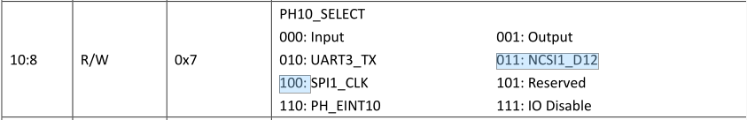
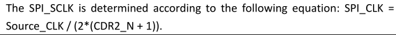
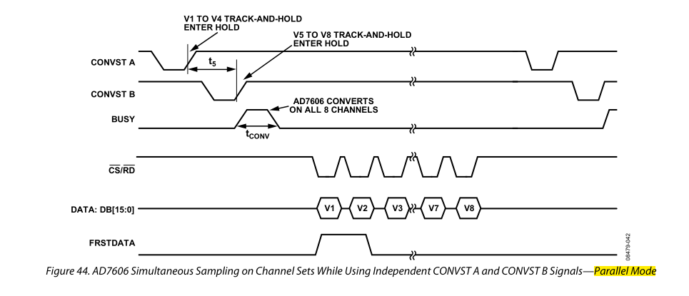
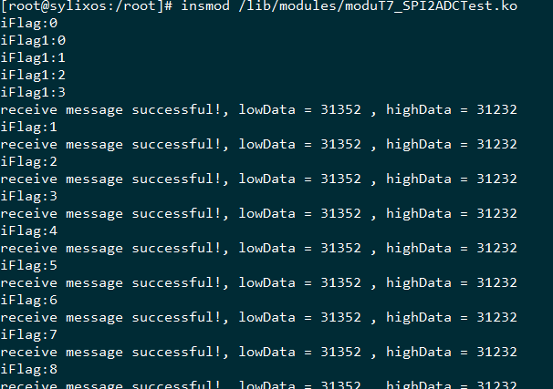
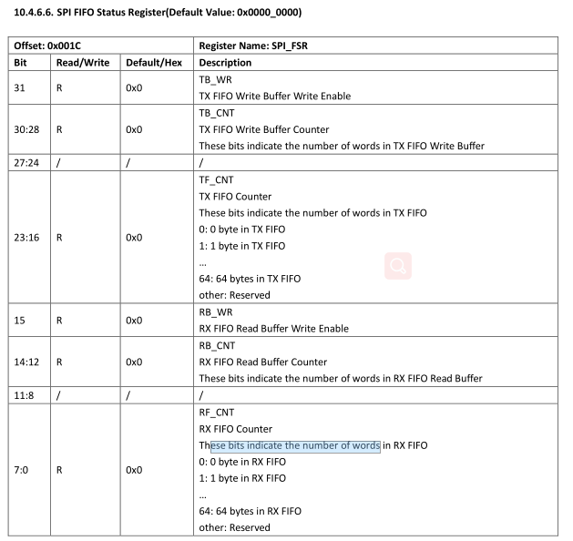

# 1 T7 SPI驱动

## 1.1 引脚配置

1. 设置GPIO引脚复用

   

2. 硬件初始化

   1. SPI硬件通道信息

      ```c
      struct spi_channel {
          LW_SPI_FUNCS        SPI_funcs;  	/*  必须为第一个                */
          PCHAR               SPI_pcBusName;  /*  总线名称                    */
          INT                 SPI_iCh;        /*  通道号                      */
          PVOID               SPI_pvBase;     /*  寄存器基地址                */
          UINT32              SPI_uiSpeedHz;  /*  总线时钟频率                */
          INT                 SPI_uiIrqNum;   /*  中断号                      */
          LW_HANDLE           SPI_semHandle;  /*  信号量                      */
          spinlock_t          SPI_sLock;
          INT                 SPI_uiCsNumber;
          INT                 SPI_uiCsBitmap; /*  表示使用的片选线            */
          UINT                SPI_uiModeType; /*  SPI 模式                    */
          UINT                SPI_uiDmaChan;  /*  DMA 通道                    */
          DUAL_MODE_DEV       SPI_uiDualMode;
      };
      ```


## 2.1 SPI 时钟频率

​	spi时钟频率=系统时钟频率/分频数，将分频数写入相应寄存器便可完成SPI_CLK配置。



```c
static VOID __spiClkSet (UINT32  uiSpiClk,
                         UINT32  uiAhbClk,
                         PVOID   pvBaseAddr)
{
    UINT32  uiRegVal = 0;
    UINT32  uiDivClk = uiAhbClk / (uiSpiClk << 1);//**********************

    SPI_DBG("set spi clock %d, mclk %d\n", uiSpiClk, uiAhbClk);
    SPI_DBG("uiDivClk %d\n", uiDivClk);

    uiRegVal = readl(pvBaseAddr + REG_SPI_CLK_CTL);
    if (uiDivClk <= SPI_CLK_SCOPE) {
        if (uiDivClk != 0) {
            uiDivClk--;
        }
        uiRegVal &= ~SPI_CLK_CTL_CDR2;
        uiRegVal |= (uiDivClk | SPI_CLK_CTL_DRS);

        SPI_DBG("uiRegVal = 0x%x \n", uiRegVal);
        SPI_DBG("CDR2 - n = %d \n",   uiDivClk);
    } else {
        uiDivClk = 0;
        while (uiAhbClk > uiSpiClk) {
            uiDivClk++;
            uiAhbClk >>= 1;
        }

        uiRegVal &= ~(SPI_CLK_CTL_CDR1 | SPI_CLK_CTL_DRS);
        uiRegVal |= (uiDivClk << 8);

        SPI_DBG("uiAhbClk = %d   \n", uiAhbClk);
        SPI_DBG("uiRegVal = 0x%x \n", uiRegVal);
        SPI_DBG("CDR1 - n = %d \n",   uiDivClk);
    }

    writel(uiRegVal, pvBaseAddr + REG_SPI_CLK_CTL);
}
```

# 3 ADC 7606

[1]: https://blog.csdn.net/u012241570/article/details/80651920	"接口详解"

## 3.1 管脚配置

### 3.1.1 需要的管脚

1. OS1、OS2、OS3 ------------------过采样
   1. flag = out
2. convst --------------------------------启动转换
   1. PE2
   2. flag = GPIOF_OUT_INIT_LOW
3. reset----------------------------------复位
   1. PE1
   2. flag = GPIOF_OUT_INIT_LOW
4. stby-----------------------------------待机模式输入
   1. PE11
   2. flag = GPIOF_OUT_INIT_HIGH
5. rang----------------------------------输入电压范围
   1. 输入已确定
6. BUSY--------------------------------中断触发
   1. PH18

### 3.1.2 管脚配置

1. reset --------------在使用ADC之前需要复位一次

   ```c
   gpio_set_value(st->pdata->gpio_reset, 1);
   ndelay(100); /* t_reset >= 100ns */
   gpio_set_value(st->pdata->gpio_reset, 0);
   ```

2. convst---------------每次读取数据前需要启动转换(**上升沿有效**)，读取结束后需要关闭转换

   ```c
   gpio_set_value(st->pdata->gpio_convst, 1);//start
   /********************读取数据*********************/
   gpio_set_value(st->pdata->gpio_convst, 0);//stop，拉低convst引脚
   ```

3. cs-----------------------通过SPI读取片选使能，低电平有效。

## 3.2 时序图



## 3.3 问题

### 3.3.1猜测





### 3.3.2实际问题

1. 只循环调用 API_SpiDeviceTransfer：

   ​		在第一次调用到SPI底层传输函数时（__spiTryTransfer），会将**SPIMSG_uiLen**清零，无法进入循环。所以读一次消息就要初始化一次**LW_SPI_MESSAGE**结构体对象。

   ```c
   pSpiMsg->SPIMSG_uiLen -= uiLen;//长度置零，因为传入的是地址，所以上层的值会受影响
   ```

   ```c
   while (uiLen && (--uiPollRxTime > 0)) {	//无法进入第二次循环
       SPI_DBG(" single read\n");
       if (__spiRxFifoQuery(pvBase)) {
           *pucRxBuf++ = readb(pvBase + REG_SPI_RXDATA);
           --uiLen;			
       }
   }
   ```

2. 大小端转换

   SPI读出的ADC数据是大端存储，需要转换为小端存储。

# 4 TWI


