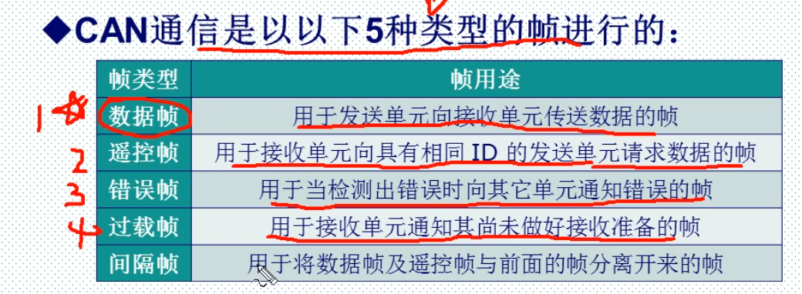
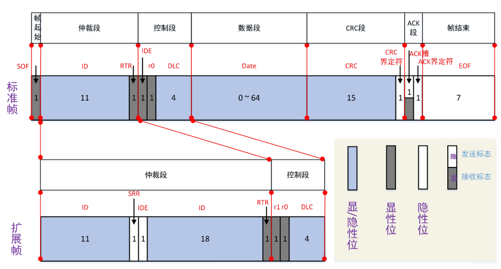
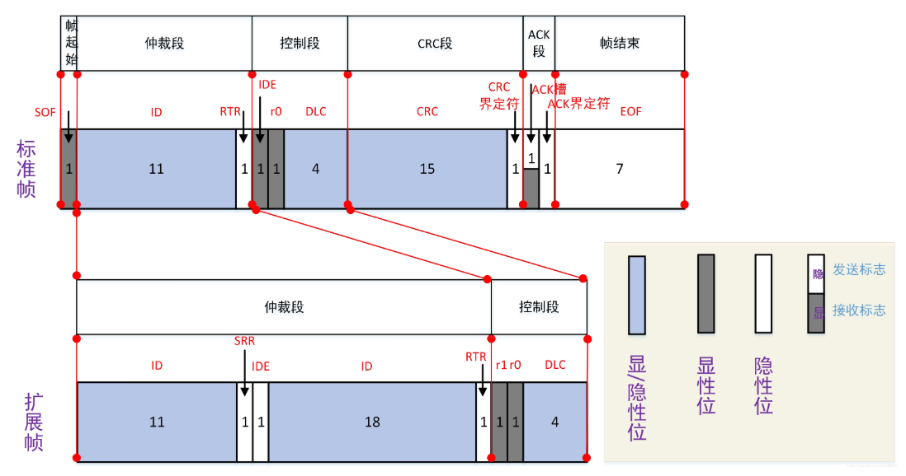
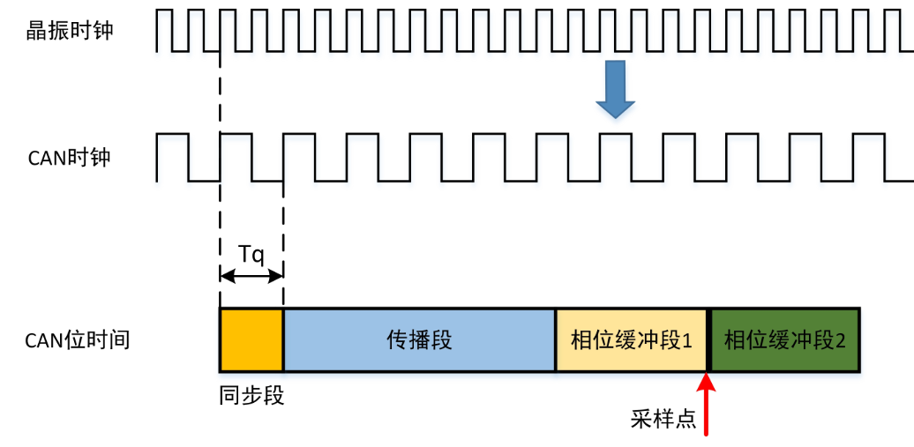

# 1什么是CAN

## 1.1 5种帧类型

1. 数据帧

   

   RTR：总是保证数据帧的优先级高于遥控帧

   SRR位的作用：在前11位ID号相同的情况下，标准数据帧的优先级高于扩展数据帧

   IDE： 在前11位ID号相同的情况下，标准遥控帧的优先级一定高于扩展遥控帧。

2. 遥控帧：请求指定ID的节点发送数据

   

# 2 位定时与同步

## 2.1 位时间

​		发送一个bit所需要的时间

1. 同步段

   数据的跳变在同步段内

tBit:位时间
tSS:同步段时间
tPS:传播段时间
tPBS1:时间段1
tPBS2:时间段2

tBit=tSS+tPS+tPBS1+tPBS2

## 2.2 同步机制

# 3 代码分析

## 3.1 驱动支持部分

1. 

## 3.2 驱动模型

1. API_CanDevCreate ：完成CAN的初始化……

   1. __canDevInit ：创建读写缓冲区……
      1. 创建读写缓冲区
      2. 初始化写状态，总线状态
      3. 创建读CAN_ulRcvSemB，写CAN_ulSendSemB同步信号，创建发送完成同步信号CAN_ulSyncSemB（发送完成，可以再次发送）
      4. 创建互斥访问锁CAN_ulMutexSemM
      5. 初始化select
      6. 初始化自旋锁
   2. 清除读写缓冲区
      1. __canFlushQueue：清空队列
         1. 清除写缓冲区
            1. 释放可写信号：CAN_ulSendSemB
            2. 释放发送完成信号：CAN_ulSendSemB
   3. 启动（安装回调）函数

   ------

   

2. __canWrite：

   1. 等待写信号
   2. 判断缓冲区时否有空间可写
   3. __canWriteQueue：向写队列中写入数据
      1. __canCopyToQueue：向 QUEUE 中节点拷贝帧信息
   4. __canTxStartup：启动发送函数，调用驱动支持