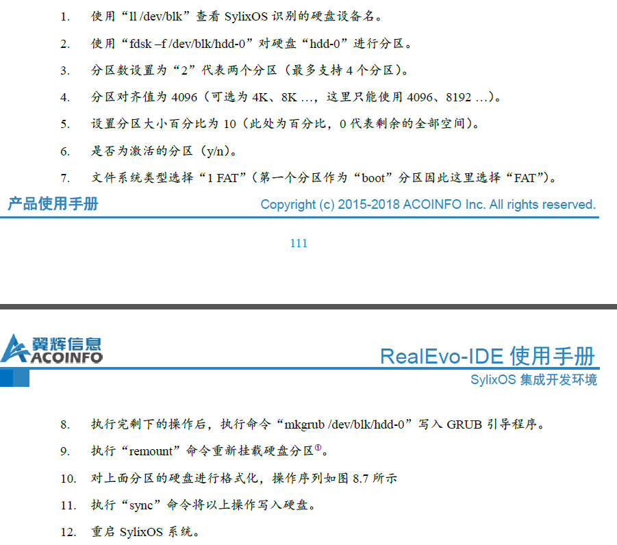

# 1 多平台启动

## 1.1 龙芯（loongson3a-3000-7a)

**注意：**readme

1. 配置PMON网口

   ```shell
    ifconfig syn0 10.4.0.154
   ```

2. 网络启动

   ```shell
   load -r -o80200000 tftp://10.4.0.245/bspls3x.bin;flush -di;g -e 80200000;
   #        偏移地址	TFTP（路径）				刷新到RAM	从偏移地启动
   ```

3.  固化到硬件

    ```
    进入SylixOS 利用FTP工具上传镜像将其写入硬盘 sync
    ```

4. 硬件自启动

   ```shell
   set al1 "-r -o80200000 (wd0,0)/bspls3x.bin;flush -di;g -e 80200000"；
   #		下载到的偏移地址 源文件
   ```

5. u盘自启动

   ```shell
   set al "-r -o80200000 (usb0,0)/boot/bspls3x.bin;flush -di;g -e 80200000"；
   #（提前把bin文件保存到U盘中）
   #load -r -o80200000 (usb0,0)/bspls3x.bin; 
   ```

## 1.2 X86

1. 利用IED 自带工具制作制作启动U盘
2. 设置BIOS U盘启动

   1. BOOT
      1. 设置hard drive bss 的选项为U盘
      2. 设置BOOT option 为U盘对应的文件格式
3. 使用IED的 TFP 工具上传 放到boot目录下

   1. bspx86.elf---------SylixOS镜像
   2. grldr-----------------grub引导程序
   3. menu.lst------------启动配置文件

# 2 固化分区

## 2.1分区,挂载步骤

1. 卸载挂载：umount     /media//hdd0(hdd1)
2. 分区:fdisk -f
   1. 第一个为主分区，选择"yes"
   2. 第二个为扩展分区，选择"no"
3. 挂载：remount /dev/blk/hdd-0              ------------------自动挂载到/media/
4. 格式化:mkfs /media/hdd0(hdd1)
5. snyc

## 2.2 磁盘分区

磁盘分为主分区和扩展分区，主分区不能再分（用来放启动程序），扩展分区可以在分为逻辑分区。

​		 *Linux* 规定了主分区（或者扩展分区）占用 *1* 至 *16* 号码中的前 *4* 个号码。以第一个 *IDE* 硬盘为例说明，主分区（或者扩展分区）占用了 *hda1*、*hda2*、*hda3*、*hda4*，而逻辑分区占用了 *hda5* 到 *hda16* 等 *12* 个号码。 

1. 分区命令---fdisk

   fdisk	*磁盘设备路径*-------------查看分区情况

   fdisk	-f  *磁盘设备路径*---------分区

2. 挂载---mount/remount/umount

   remount *磁盘设备路径*----------挂载

   umount *mount path*---------------卸载

3. 格式化  mkfs *mount path*

