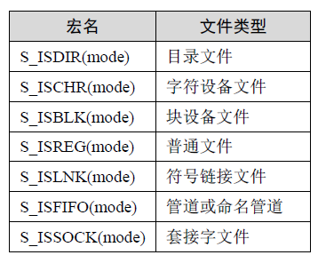
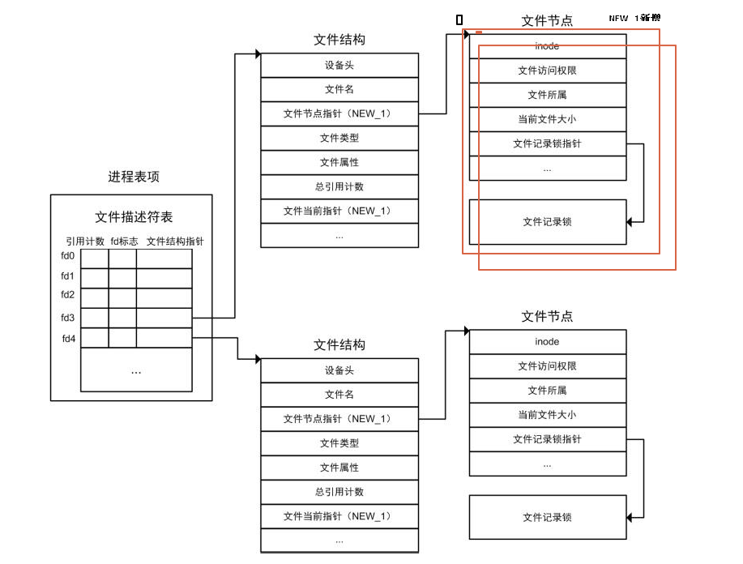
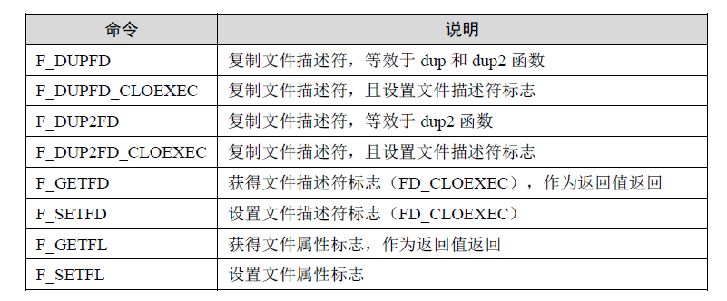
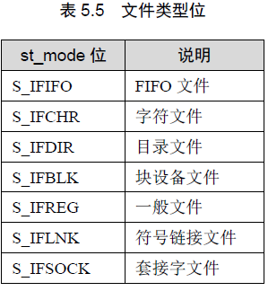
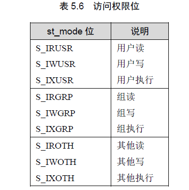
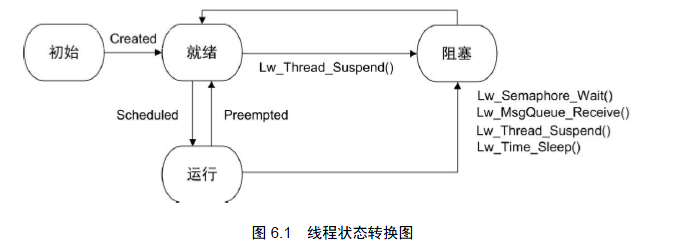
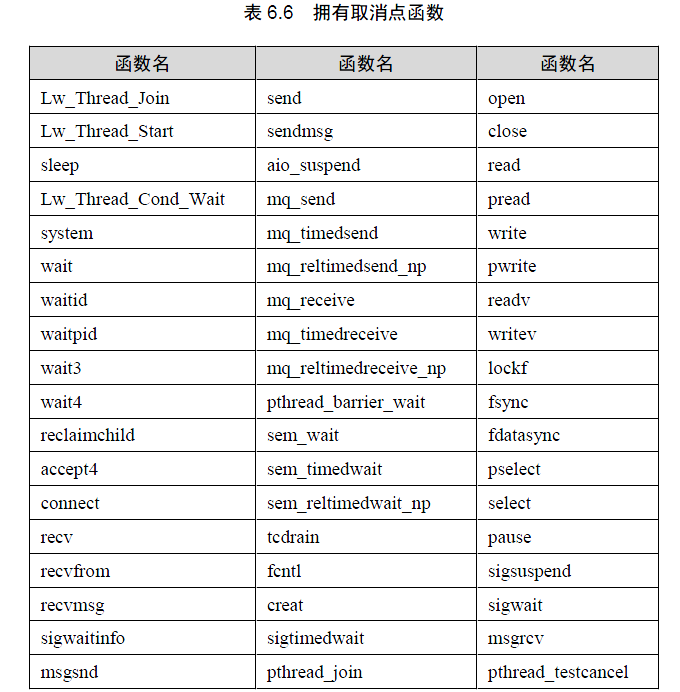
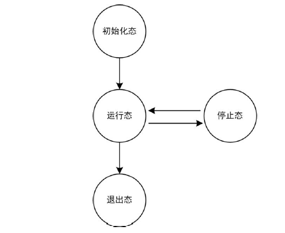

1. 3. 

# 2 shell

命令解析器，ttinyShell运行在内核空间。

## 2.1 TFTP


# **3应用开发**

# 3IO系统

## 3.1 IO系统

1. 子进程继承父进程的所有文件描述符

2. 文件描述符类型

   

3. 1底层对多上层（倒金字塔）

   

4. NEW_1 型

   

5. 多个独立的进程打开同一个文件

   每个进程都获得一个各自的文件结构，同一个文件只有一个文件节点，但是**每个进程有自己独立的读写指针。**

   

## 3.2标准IO（同步IO）

1. open 打开的是系统中最小的且尚未使用的文件描述符

   

2. 当打开一个文件时当前文件偏移量总被置为0

3. 原子操作：有多步组成的一个操作，要么全部执行完，要么一步也不执行。

4. fcntl （iCmd 宏）

   

5. st_mode

   

   



# 4 线程管理

## 4.1 线程

- 线程是一个任务，即某个单一指令流。
- 资源：CPU寄存器，栈
- 内核线程共享内核所有资源
- 进程中的线程共享进程内所有资源
- 同一个CPU同一时刻只能运行一个任务，进程的执行有优先级

## 4.2 线程状态机

- 阻塞：等待条件或资源满足才可以进入就绪态。

- 就绪：条件和资源都满足，等待系统调度方可进入运行态。

  运行

  

  

  [^1]: 线程状态装换图

## 4.3 SylixOS线程

### 4.3.1线程属性:优先级、栈信息、线程参数

1. 线程控制块
   - 栈区的起始位置
   - 栈区的终止位置
   - 栈警戒点

### 4.3.2 线程栈

- 每个线程拥有队里的栈区
- 用于线程上下文恢复
- 线程之间没有地址保护机制

### 4.3.3 多线程安全

- 可重入函数：无论被调用多少次，都不会改变其内部的数据
- 有全部变量或者静态变量的函数都不是重入函数，需要加互斥锁
- 线程私有数据

### 4.3.4 线程结束

- 线程删除：强制删除，可能会造成加锁的资源得不到释放或者原子操作被打断

- 线程退出：线程执行完毕后主动退出，显式的调用可以指定返回码，返回给JOIN函数

  - 线程等待：调用pthread_join函数的线程会等待目标线程的结束

- 线程取消：目标线程可以将取消请求挂起（**延迟取消**）**pthread_cancel**

  - 取消状态：允许取消和禁止取消，决定是否能被其他线程取消

    

  - 取消类型：异步取消和延迟取消

    

    

  - 取消点：

    

### 4.3.5 参数传递问题

​	主线程在创建子线程的同时可以给子线程传递参数，如果传递给子线程的数据是主线程中的数据，那么在主线程退出后，子线将得不到这些数据。

采用值传递的方式可以解决：即把要传递的数据强转为地址

```c
(PVOID)data
```

### 4.3.6线程建值

## 4.4 线程调度

**实时系统：**采用优先级调度，从就绪的任务队列中选择优先级最高的运行。

**影响因素：**

- 调度策略
- 任务优先级

### 4.4.1优先级调度

- **可抢占式调度**：当更高优先级线程就绪时，系统中断当前线程来调度高优先级线程。
- 优先级：0 - 255；0最高
- 静态调度：内核不会动态的计算线程的优先级

### 4.4.2RR调度

用在同等优先级的线程之间，基于时间片的轮转调度

### 4.4.3 RSM调度

### 4.4.4 协程

# 5 线程建通信

## 5.1 线程间通信

- 互斥型通信：
- 通知型通信：
- 消息型通信：

### 5.1.1 二进制信号量：true/false

- 把初始值为true的信号量作为锁

### 5.1.2 计数型信号量

1. 创建
2. 删除
3. 等待，信号量为0阻塞
4. 释放
   1. 释放一个
   2. 释放多个
5. 清除，把信号量的初始值值为0
6. 释放等待在指定信号量的线程
7. 获取状态信息

### 5.1.3 读写信号量

- 写的时候不响应任何锁
- 读的时候可以允许其他进程读，首先响应写锁。

## 5.2 优先级反转

由于互斥的存在，高优先级的进程因为得不到信号量而被低优先级的进程阻塞

**解决办法**

- 改变占有资源的线程的优先级

- 只有互斥信号量才支持：
  - 优先级天花板
  - 优先级继承

## 5.3 死锁

### 5.3.1 产生的条件

- 互斥条件
- 不可抢占条件
- 占有且申请条件
- 循环等待条件

### 5.3.2 死锁的预防

- 打破四个条件之一

# 6 进程管理

## 6.1实时进程

- 进程是一个资源容器，管理代码、数据、文件描述符、socket套接字、线程和信号量等资源。
- SylixOS所有进程公用一个地址空间，任务切换过程中不需要切换页表
- 使用实时调度算法调度

## 6.2 进程状态机

- 初始态

- 运行态

- 退出态

- 停止态

  

# 7 内存管理

## 7.1 定长内存管理

1. 创建
2. 获取
3. 返还
4. 删除

## 7.2边长内存管理

## 7.3 虚拟内存管理

- 内存划分
  - 通用内存区就是内核空间，虚拟地址和物理地址完全相同
  - VMM管理区


# 8 Cache

## 8.1 cache line

​											置位	|	内存块地址	| 	内存中的数据


## 8.2 Write back

根据cache line是否被移除来决定是否写入到内存中

