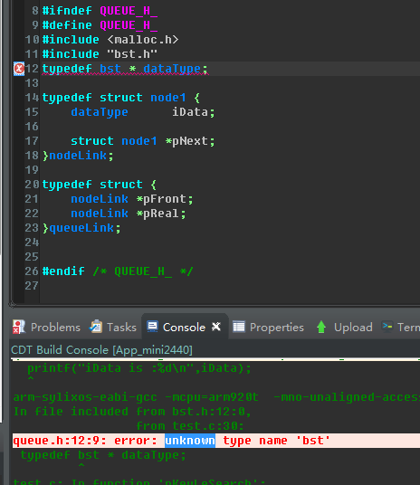

# 1 学习计划

- [x] 周四：完成准备工作。申请Redmine账号，在Redmine上面提交第一周培训计划，完成Sylixos软件开发环境的安装，完成Git的安装配置。
- [x] 周五：学习RealEvo-IED的使用
- [x] 周一：学习RealEvo-Simulator的使用
- [x] 周二：学习RealEvo-QtSylixOS的使用
- [x] 周三：熟悉公司文档/代码规范和编程试题

ip 配置

```shell
ifconfig en1 inet 10.4.0.154
ifconfig en1 netmask 255.255.0.0
ifconfig en1 gataway 10.4.0.1
```

# 2 问题日志

## 2.1 IED添加新的源文件无法自动编译

11：00


找不到函数?，重新创建一个！！！

## 2.2 递归函数的返回

19：00--21：00

```c
bst *pkeySearch (bst *pbstRoot, int  iKey)					/*  查找Key节点					  */
{

	if (pbstRoot->iKey == iKey) {
		bst *GpbstTemp;
		printf("search success !\n");
		GpbstTemp = pbstRoot;
		printf("iKey:%d\n",GpbstTemp->iKey);
		return GpbstTemp;  								 //不能正常返回。
	}

	if (pbstRoot->pbstLeft  != NULL) {
		pkeySearch(pbstRoot->pbstLeft, iKey);
	}

	if (pbstRoot->pbstRight != NULL) {
		pkeySearch(pbstRoot->pbstRight, iKey);
	}
}
```

### 1. 解决办法：

1. 全局变量

2. return

   ```c
   Node* bstree_search(BSTree x, Type key)
   {
       if (x==NULL || x->key==key)
           return x;
   
       if (key < x->key)
           return bstree_search(x->left, key);
       else
           return bstree_search(x->right, key);
   }
   ```

   

### 2. 分析：

1. 在递归还没有结束的情况下，有返回值产生，调用该递归函数的另一个函数无法正常拿到该返回值。
2. 注意局部变量在函数执行完之后销毁！（函数中保存在栈中的数据消亡）
3. 函数的参数是指传递（指针也是值传递，传的是地址值）
4. 函数的返回值返回的是值（指针返回的是地址值)

## 2.3 异或的妙用

​		 从头到尾依次异或数组中的每一个数字，那么最终的结果刚好是那个只出现一次的数字，因为那些出现两次的数字全部在异或中抵消掉了。 **（异或具有记忆性）**

```c
 int resultExclusiveOR = 0;
      for (int i = 0; i < length; ++ i)
            resultExclusiveOR ^= data[i];
```

## 2.3 unknow type name 'bst'



## 2.4 链队列的出队错误。

```c
/*链队列的结构*/
/****************************************************************************************************
  链表节点定义
****************************************************************************************************/
typedef bst* dataType;										/*	定义节点数据类型			    */
typedef struct nodeQueue {
	dataType 	 data;									   /*	节点数据				      */

	struct nodeQueue *pNext;							    /*	 节点指针					  */
}nodeLink;
/****************************************************************************************************
  链式队列定义
****************************************************************************************************/
typedef struct {
	nodeLink *pFront;										/*	队头节点					 */
	nodeLink *pReal;										/*	队尾节点					 */
}queueLink;
/*创建队列首节点*/
queueLink *pqueueHeaderCreate ()
{
	nodeLink *pNode   = (nodeLink *)malloc(sizeof(nodeLink));
	pNode->pNext      = NULL;

	queueLink *pqueueHeader = (queueLink *)malloc(sizeof(queueLink));
	pqueueHeader->pFront    = pNode;
	pqueueHeader->pReal     = pNode;

	return pqueueHeader;
}
/*入队函数，尾插法*/
void queueInput (queueLink *pQueue, dataType data)
{
	nodeLink *pTemp = (nodeLink *)malloc(sizeof(nodeLink));
	pTemp->data     = data;

	pTemp->pNext         = pQueue->pReal->pNext;
	pQueue->pReal->pNext = pTemp;
	pQueue->pReal        = pTemp;
    /*队尾的指针指向了pTemp,也指向了自己。当不在有新数据入队时，pReal指向了最后一个数据,当出队函数释放掉最后一个	数据时，也释放掉了pReal*/
}
/*出队函数，头删法*/
dataType queueOutput (queueLink *pQueue)
{
	dataType iData;

	if (pQueue->pFront == pQueue->pReal) {
		printf("Queue is empty!\n");
		return NULL;
	}
	nodeLink *pTemp;
	pTemp                 = pQueue->pFront->pNext;//如果队列里面只有一个数据，pFront->next->next为空
	pQueue->pFront->pNext = pTemp->pNext;//如果pFront的后面的后面没有数据，pFront->pNext会指向NULL。

	iData                 = pTemp->iData;
	free(pTemp);
	pTemp = NULL;
    
    /******************************************修正方法*********************************************/
	if (pQueue->pFront->pNext == NULL) {
		//pQueue->pFront = pQueue->pReal;错误！！！
        pQueue->pReal = pQueue->pFront;//由于pReal被释放掉了，所以需要重新赋值，指向pFront;
	}
	return iData;
}
```


# 3 总结

## 1 代码规范

### 1.1 变量命名（非应用程序）

```c
int    _GiMax;		//__作用域（G）+类型（p/i/c/f/结构体名）+描述(变量名首字母大写)
/************************************************************************************************/
int    iLength = 10;
int    iWeight = 20;

char    cGet;
char   *pcGet;//pfunc
```

|                    类型                     |   缩写    |
| :-----------------------------------------: | :-------: |
|     整型(int、unsigned int、signed int)     | i、ui、si |
| 短整型(short、unsigned short、signed short) | s、us、ss |
|  长整型(long、unsigned long、signed long)   | l、ul、sl |
|            浮点型(float、double)            |   f、d    |
|  字符型(char、unsigned char、signed char)   | c、uc、sc |

### 1.2 函数规范(非应用程序)

```c
int __motorRun (int  iSpeed, int  iDirection)
{
    ……
}

int __motorRun (int  iSpeed,
			   int  iDirection,
			   int  iTime)
{
	……
}
/*
1.返回值类型后一到两个空格
2.函数名与参数列表一个空格
3.参数类型与变量名两个空格
*/
```

### 1.3 语句

1. 

2. 长语句

   ```c
   pcName = &cBuffer[0];
   pucArg++;
   
   memmsgBuffer[i].uiLen = NO7_TO_STAT_PERM_COUNT_LEN /*赋值语句						*/
   					+ (STAT_SIZE_FILE_LEN * sizeof(char))
   					+ (STAT_SIZE_PER_FRAM * sizeof(__MEM_PAGE));
   
   if (ucDestIp[0] == ucTemp[0] &&					 /*  if长语句						*/
   	ucDestIp[1] == ucTemp[1] &&
   	ucDestIp[2] == ucTemp[2] &&
   	ucDestIp[3] == ucTemp[3]) {					 
   
   	__ethSendFrame(……);						
   									
   } else {		  							    /* else空一行					  */
       ……
   }
   
   for (i  = 0;									/*  for 循环语句	        		*/
       (i  < 10 && pucTempName != NULL);
        i += 2) {									
   
   	……
   }
   /*
   不允许把多个短语句写在一行中，即一行只写一条语句
   */
   
   switch (pmsgM.iId) {							/*  switch语句				*/
   
   case MSG_ID_1:								    /*  分支 1					*/
   	……
   	break;									   /*  跳出					    */
   
   case MSG_ID_2:								    /*  分支 2					 */
   	……
   	break;									   /*  跳出						*/
   
   default:									   /*  默认处理				        */
   	……
   }
   git@github.com:SongXiaoLongg/TestGitHub.git
   ```

   ## 3.2  二叉搜索树

   1. 创建

      ```c
      typedef int Type;
      
      typedef struct BSTreeNode{
          Type   key;                    // 关键字(键值)
          struct BSTreeNode *left;    // 左孩子
          struct BSTreeNode *right;    // 右孩子
          struct BSTreeNode *parent;    // 父结点
      }Node, *BSTree;
      
      static Node* create_bstree_node(Type key, Node *parent, Node *left, Node* right)
      {
          Node* p;
      
          if ((p = (Node *)malloc(sizeof(Node))) == NULL)
              return NULL;
          p->key = key;
          p->left = left;
          p->right = right;
          p->parent = parent;
      
          return p;
      }
      ilen = TBL_SIZE(arr);
           for(i=0; i<ilen; i++)
           {
               printf("%d ", arr[i]);
               root = insert_bstree(root, arr[i]);
           }
      ```

      


