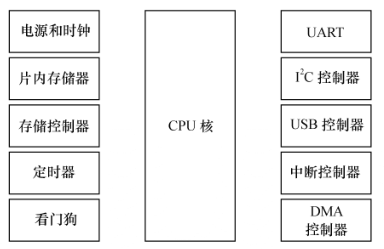
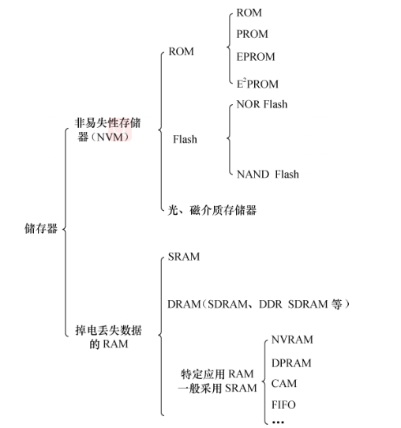
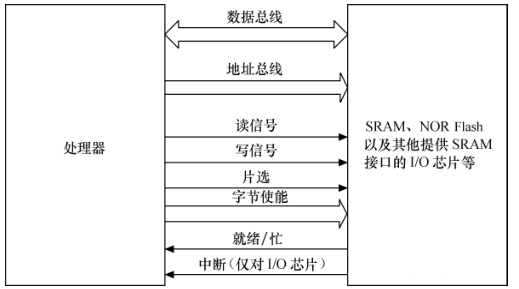
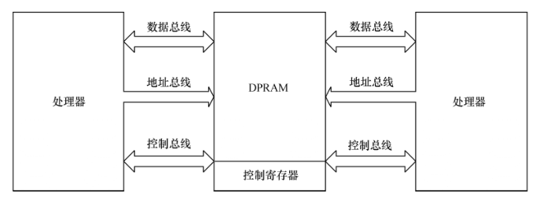
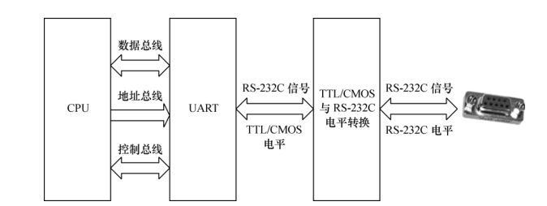

# 1 硬件基础

## 1.1 处理器

MCU

## 1.2 存储器

**分类：**

### 1.2.1 flash

​		flash 只能将 1 写 0，不能将 0 写 1。所以在编程前需要将对应的块擦除，把所有的位都写1。

**NOR flash**

1. 可片内执行
2. sARM接口，不需要额外的控制电路

**NAND flash**

1. 需要控制电路转换
2. 以块方式访问
3. 不可片内执行

### 1.2.2 RAM

- 静态（SRAM）：NVRAM（非易失性RAM）
- 动态（DRAM）：SDRAM, DDR。

APRAM：双端口RAM，用在两个CPU之间交换数据。

## 1.3 接口与总线

### 1.3.1 串口

### 1.3.2 USB

主机：控制器，连接器---->设备：适配器，连接器

### 1.3.3 以太网接口

​		以太网接口由MAC(以太网接入控制器)和PHY组成(物理接口收发器)组成，MAC和PHY之间用MII(媒体独立接口)连接。

**MII媒体独立接口**

- 数据接口：16个信号线
  - 发送信道
  - 接收信道
- 管理接口：2个信号线
  - 时钟信号
  - 数据信号